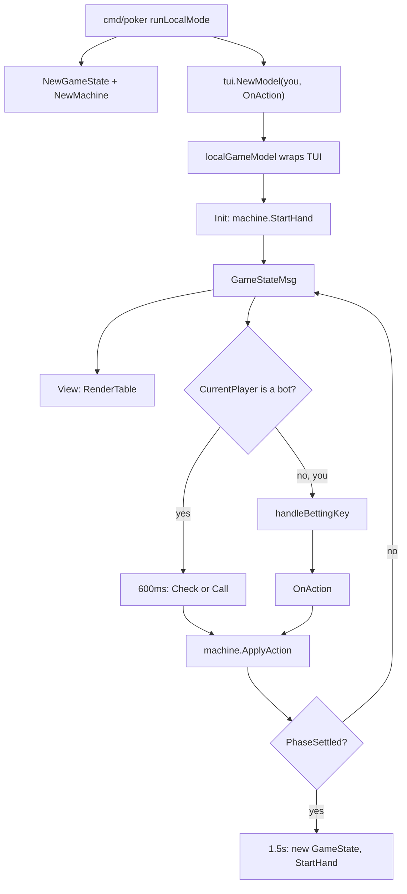

# Phase 2 — Pure Hold’em engine (and the local UI)

This is the second onboarding chapter. After it you should be able to **trace a fold, a raise, a side pot, and a showdown through `internal/game`, and explain why the TUI never contains the rules.** You still do not need sockets, SRA, or escrow.

The reading list this chapter expands is in [`READ_GUIDE.md`](./READ_GUIDE.md). The teaching narrative it sits next to is [`HOW_IT_WORKS.md`](./HOW_IT_WORKS.md) §§7 and 10 (Hold’em as the engine models it; the reducer). Phase 1’s local-mode walkthrough ([`PHASE_1.md`](./PHASE_1.md) §14) is the lab you already ran; this chapter is that loop with the engine files open.

**You are here to learn:** the engine is a pure reducer. Same seats + same ordered actions + same card inputs → same pots and winners on every honest machine. Cards in crypto mode are *inputs*, not something `Machine` samples. The TUI is a picture of `GameState` plus a callback.

**Do this with your hands before you finish the chapter:** play one local hand (`./poker` or `.\poker.exe`) with [`internal/game/machine.go`](./internal/game/machine.go) open. Every keystroke becomes an `Action` into `ApplyAction`. Then run:

```bash
go test ./internal/game ./internal/tui -count=1
```

**Do not read yet:** `internal/network` except curiosity, `internal/crypto`, `internal/fault`, `contracts/`, `plans/`. The engine must make sense with zero sockets. Phase 3 is where unordered gossip becomes a total order of these same `Action` values.

**Architectural rule to keep in your head the whole time:** `internal/game` never imports `internal/network`. Networking produces authenticated, ordered inputs. The engine reduces them. Mixing those layers is how “the host accidentally becomes the server” happens.

---

## Table of contents

1. [How to use this chapter](#1-how-to-use-this-chapter)
2. [The one idea: a pure reducer](#2-the-one-idea-a-pure-reducer)
3. [Hold’em as the engine models it](#3-holdem-as-the-engine-models-it)
4. [Package map](#4-package-map)
5. [Cards and the deck](#5-cards-and-the-deck)
6. [Players](#6-players)
7. [Phases, actions, and `GameState`](#7-phases-actions-and-gamestate)
8. [Pots and side pots](#8-pots-and-side-pots)
9. [Hand evaluation](#9-hand-evaluation)
10. [The machine: construction and `StartHand`](#10-the-machine-construction-and-starthand)
11. [`ApplyAction` case by case](#11-applyaction-case-by-case)
12. [When a betting round ends](#12-when-a-betting-round-ends)
13. [Crypto mode: cards as inputs](#13-crypto-mode-cards-as-inputs)
14. [Call graph from local mode](#14-call-graph-from-local-mode)
15. [Worked example: one plaintext hand](#15-worked-example-one-plaintext-hand)
16. [Worked example: crypto mode with empty opponent holes](#16-worked-example-crypto-mode-with-empty-opponent-holes)
17. [The TUI: a picture of `GameState`](#17-the-tui-a-picture-of-gamestate)
18. [Hole-card hiding](#18-hole-card-hiding)
19. [Tests in this phase](#19-tests-in-this-phase)
20. [Common mistakes](#20-common-mistakes)
21. [Exit check](#21-exit-check)
22. [Phase 2 glossary](#22-phase-2-glossary)

---

## 1. How to use this chapter

Read top to bottom once. When a code excerpt appears, open that file in the editor and match the excerpt to the live source. Line numbers here were accurate when this chapter was written; if they drift, trust the file.

This chapter is **not** a rewrite of [`HOW_IT_WORKS.md`](./HOW_IT_WORKS.md) §7 or §10. Those sections are the short version. This file is the types, the call graph, two worked hands, and the mistakes people make the week they first edit `machine.go`.

Suggested time: the rest of the afternoon after Phase 1, including one local game with `machine.go` open. Stop when the [exit check](#21-exit-check) is true.

File order matches the read guide. Do not skip to `machine.go` before `deck.go` / `player.go` / `state.go` / `pot.go` / `hand_eval.go` make sense — `Machine` is a composition of those types, not a second rules engine.

---

## 2. The one idea: a pure reducer

A **reducer** takes the current state and one input and returns a new state (here: it mutates `*GameState` in place, same idea). It does not talk to the network. It does not ask “who am I.” It does not sample cards unless the caller gave it a local `Deck` and called `StartHand`.

[`HOW_IT_WORKS.md`](./HOW_IT_WORKS.md) §10 puts it this way: if every honest replica starts from the same seats, blinds, and dealer, and applies the same actions (and, in crypto mode, the same peeled cards), they cannot disagree on the pot.

```
identical GameState  +  identical ordered Action list  +  identical card inputs
        →  identical pots, stacks, and PhaseSettled
```

That identity is why later phases can be sloppy about *who broadcasts* and strict about *what is applied*. Gossip can arrive in any order; the sequencer (Phase 3) turns it into a total order; `ApplyAction` is the function that order is for.

Two start paths, one reducer:

| Path | Who shuffles | Where cards come from |
|---|---|---|
| `StartHand` | this process, Fisher–Yates on `gs.Deck` | `Deck.Deal()` for holes and streets (burns included) |
| `StartHandCrypto` | nobody in this package | caller fills local holes; later `ApplyStreet` / `ApplyHoleReveal` |

Crypto mode is detected with one pointer:

```478:480:internal/game/machine.go
func (m *Machine) cryptoMode() bool {
	return m.State != nil && m.State.Deck == nil
}
```

`Deck == nil` is not “the deck ran out.” It is a mode flag. `StartHand` refuses to run without a deck; `StartHandCrypto` *sets* the pointer to nil. Do not invent a second boolean.

The engine has **no concept of a local player**. Requiring “our” hole cards inside `StartHandCrypto` would make two honest replicas disagree on whether the hand can start. Each replica fills whatever holes it already knows (Phase 4: local only) and leaves the rest empty. Showdown waits. Fold-to-winner does not.

If Bob’s client later broadcasts “I won with a full house,” Alice’s replica ignores that claim. She has the action log and, at showdown, the revealed cards. She computes the winner. `HAND_RESULT` on the wire (Phase 3) is informational. A lying result does not move chips on an honest replica.

---

## 3. Hold’em as the engine models it

Skip the poker-rules recap if you already play. The vocabulary has to match the types.

From [`HOW_IT_WORKS.md`](./HOW_IT_WORKS.md) §7:

- **Seats** 2–9 locally, 3–9 on P2P. Each seat has a stack (default buy-in 1000).
- A **dealer button** rotates. **Small blind** and **big blind** post forced bets (defaults 5 and 10). Heads-up: dealer is SB, the other seat is BB.
- Each player gets **two hole cards**, dealt starting left of the dealer, two rounds (one card each, then one card each again).
- Betting rounds: **pre-flop**, **flop** (three community cards, after a burn), **turn** (one card, after a burn), **river** (one card, after a burn).
- Legal actions: fold, check, call, raise, all-in. A raise must meet `MinRaise`. `Action.Amount` on a raise is the **increment above the current bet**, not the total.
- If everyone but one folds, that player wins the pot — **no cards needed**.
- Otherwise **showdown**: best five-card hand from seven (two hole + five community). Ties split; odd chips go to the winner closest left of the dealer.
- **Side pots** appear when someone is all-in for less than others put in. Eligibility is “who contributed to this layer.”

Plaintext phases:

```
Waiting → PreFlop → Flop → Turn → River → Showdown → Settled
```

Crypto mode inserts **Awaiting Street** after a betting round ends, until something outside the engine peels the next public cards and calls `ApplyStreet`. That phase is how the engine avoids dealing from a local deck it does not have.

```
Waiting → PreFlop → AwaitingStreet → Flop → AwaitingStreet → Turn
        → AwaitingStreet → River → Showdown → (ApplyHoleReveal*) → Settled
```

`ApplyAction` is illegal in Waiting, Awaiting Street, Showdown, and Settled. Streets and reveals are not actions; they are card inputs.

---

## 4. Package map

This phase lives in two packages. Both are imported by `cmd/poker`. Neither imports the other direction you might fear: `game` does not import `tui`. `tui` imports `game` as data to draw.

```
internal/game/          Pure Hold’em. No sockets. Same inputs → same outputs
  deck.go               Card, CardID 0..51, Deck, Fisher–Yates, Deal
  player.go             Stack, holes, status, PlaceBet
  state.go              Phase, Action, GameState, whose turn
  pot.go                Main + side pots from contribution layers
  hand_eval.go          Best 5 of 7, rank then kickers
  machine.go            The only betting mutation
  game_test.go          Plaintext rules: blinds, side pots, showdown
  machine_crypto_test.go  Engine with Deck == nil

internal/tui/           Bubble Tea picture of GameState
  styles.go             Colors / layout constants
  card_view.go          How a card is drawn (face-up, back, placeholder)
  player_panel.go       Hides opponent holes unless local or winner
  table_view.go         Board, pot, seats
  log_view.go           Action / network log
  bet_input.go          Check / call / raise / fold / all-in widget
  model.go              Elm-style Model; actions leave via OnAction
  tui_test.go           Rendering and input
```

Imports in `internal/game` are `fmt`, `math/rand`, and `sort`. That is the whole world. If a future diff adds `internal/network` here, revert it.

`internal/tui` talks to Charm Bubble Tea and Lip Gloss, plus `internal/game`. It does not import `internal/network` or `internal/crypto`. Network log lines are strings the caller stuffed in via `NetworkMsg`.

---

## 5. Cards and the deck

File: [`internal/game/deck.go`](./internal/game/deck.go)

### 5.1 Rank, suit, card

A card is a rank (2–Ace) and a suit (spades, hearts, diamonds, clubs). Suits are `iota` from 0: Spades, Hearts, Diamonds, Clubs. Ranks start at `iota + 2` so `Two` is the integer 2, `Ace` is 14.

```55:77:internal/game/deck.go
type Card struct {
	Rank Rank
	Suit Suit
}

func (c Card) String() string {
	return c.Rank.String() + c.Suit.String()
}

func (c Card) CardID() int {
	return int(c.Suit)*13 + int(c.Rank-2)
}

func (c Card) dealt() bool {
	return c.Rank >= Two && c.Rank <= Ace && c.Suit <= Clubs
}

func CardFromID(id int) Card {
	return Card{
		Suit: Suit(id / 13),
		Rank: Rank(id%13) + 2,
	}
}
```

**Card id `0..51` is the integer cryptography will encrypt later.** Spades 2 is 0; clubs ace is 51. `CardFromID` is the inverse. `TestCardRoundTrip` locks this. If you change the formula, Phase 4’s field-element encoding breaks even if Hold’em still “works.”

`dealt()` is the zero-value guard. A `Card{}` (rank 0, suit 0) is **not** a two of spades — `Two` is 2, so the zero card fails `Rank >= Two`. Crypto mode uses that: empty opponent holes are zero cards; `ApplyStreet` / `ApplyHoleReveal` reject them; the TUI draws placeholders.

### 5.2 The deck (plaintext only)

```79:112:internal/game/deck.go
type Deck struct {
	Cards []Card
}

func NewDeck() *Deck {
	d := &Deck{}
	for s := Spades; s <= Clubs; s++ {
		for r := Two; r <= Ace; r++ {
			d.Cards = append(d.Cards, Card{Rank: r, Suit: s})
		}
	}
	return d
}

func (d *Deck) Shuffle(rng *rand.Rand) {
	if d == nil || rng == nil {
		return
	}
	rng.Shuffle(len(d.Cards), func(i, j int) {
		d.Cards[i], d.Cards[j] = d.Cards[j], d.Cards[i]
	})
}

func (d *Deck) Deal() (Card, error) {
	if d == nil {
		return Card{}, fmt.Errorf("Deck.Deal: deck is nil")
	}
	if len(d.Cards) == 0 {
		return Card{}, fmt.Errorf("deck is empty")
	}
	c := d.Cards[0]
	d.Cards = d.Cards[1:]
	return c, nil
}
```

`NewDeck` builds 52 cards in suit-major order. `Shuffle` is Fisher–Yates via `rand.Rand.Shuffle`. `Deal` pops from the **front**. Nil receiver returns an error; it used to panic, and `TestDealFlop_NilDeck_NoPanic` exists so that does not come back.

In **crypto** mode the machine’s `Deck` pointer is nil. The engine is not allowed to sample cards. Streets arrive through `ApplyStreet`. Opponent holes arrive through `ApplyHoleReveal`. Burns exist only on the plaintext path; the crypto protocol skips burn indexes and the reducer never sees them.

Local mode’s RNG is `time.Now().UnixNano()` — not shared, not reproducible. That is fine: there is only one process. P2P `--no-crypto` (Phase 3) will use a shared seed so every replica shuffles the same way. Same `Shuffle` function, different `*rand.Rand`.

---

## 6. Players

File: [`internal/game/player.go`](./internal/game/player.go)

```18:26:internal/game/player.go
type Player struct {
	ID         string
	Name       string
	Stack      int64
	HoleCards  [2]Card
	Status     PlayerStatus
	CurrentBet int64
	TotalBet   int64
}
```

| Field | Meaning |
|---|---|
| `ID` | Stable seat identity. Local human is `"you"`; bots are `"bot-1"`; P2P uses the libp2p peer id string |
| `Name` | Display only. The engine never matches on it |
| `Stack` | Chips behind. Demo counters, not ETH |
| `HoleCards` | Two cards. Zero-value until dealt or revealed |
| `Status` | Active / Folded / All-In / Sitting Out |
| `CurrentBet` | Chips put in **this betting round** |
| `TotalBet` | Chips put in **this hand** (all rounds). This is what pots are built from |

`CanAct` is true only for `StatusActive`. All-in players are in the hand (`PlayersInHand`) but they do not get a turn (`nextActiveIndex` skips them). Folded players are in neither.

### 6.1 `PlaceBet` is the only stack drain

```45:54:internal/game/player.go
func (p *Player) PlaceBet(amount int64) int64 {
	if amount >= p.Stack {
		amount = p.Stack
		p.Status = StatusAllIn
	}
	p.Stack -= amount
	p.CurrentBet += amount
	p.TotalBet += amount
	return amount
}
```

Callers ask for an amount; the player may go all-in for less. The return value is what actually moved. Blinds use that: a short stack posting the big blind can become all-in on the post.

`PlaceBet` does **not** update `GameState.CurrentBet`. That is the table’s “how much to match this round,” owned by `Machine`. Mixing the two fields is a common edit-time bug.

### 6.2 Resets

```56:65:internal/game/player.go
func (p *Player) ResetForNewHand() {
	p.HoleCards = [2]Card{}
	p.Status = StatusActive
	p.CurrentBet = 0
	p.TotalBet = 0
}

func (p *Player) ResetForNewRound() {
	p.CurrentBet = 0
}
```

`ResetForNewHand` does **not** touch `Stack`. Stacks persist across hands; that is how a session works. `NewGameState` calls `ResetForNewHand` on every seat, so you must not rely on leftover holes from the previous `GameState` that reused the same `*Player` pointers — local mode reuses the slice.

`StatusSittingOut` exists in the enum and the TUI badge. The live local/P2P loops do not set it. Treat it as reserved, not as a feature you should hook a new rule onto without a test.

---

## 7. Phases, actions, and `GameState`

File: [`internal/game/state.go`](./internal/game/state.go)

### 7.1 Phases

```7:16:internal/game/state.go
const (
	PhaseWaiting Phase = iota
	PhasePreFlop
	PhaseFlop
	PhaseTurn
	PhaseRiver
	PhaseShowdown
	PhaseSettled
	PhaseAwaitingStreet // crypto mode: waiting for ApplyStreet; keep last so existing ints stay stable
)
```

`PhaseAwaitingStreet` is **appended** so the integer values of the older phases never change. If you insert it in the “logical” place (between PreFlop and Flop), every log, test, or proto that stored a `Phase` as a number silently shifts. Keep it last.

### 7.2 Actions

```33:55:internal/game/state.go
const (
	ActionFold ActionType = iota
	ActionCheck
	ActionCall
	ActionRaise
	ActionAllIn
)

type Action struct {
	PlayerID string
	Type     ActionType
	Amount   int64
}
```

`Amount` is used on **raise** (the increment). Fold / check / call / all-in ignore it. The TUI’s raise widget writes that increment; `ApplyAction` computes `toCall + Amount` as the chips to `PlaceBet`.

There is no `ActionBlind` type. `postBlinds` appends two `ActionRaise` entries to `Log` so the UI has something to show. That is a logging convenience, not a real raise: it does not go through `ApplyAction`, and it does not use `MinRaise`. Do not teach the log as a replay tape without re-deriving blinds from `StartHand`.

### 7.3 `GameState`

```57:82:internal/game/state.go
type GameState struct {
	TableID    string
	HandNum    int
	SmallBlind int64
	BigBlind   int64

	Players []*Player

	DealerIdx     int
	ActionIdx     int
	LastRaiserIdx int

	Phase Phase

	CommunityCards []Card
	Deck           *Deck

	Pots []PotSlice

	CurrentBet       int64
	MinRaise         int64
	RoundActionCount int

	Log     []Action
	Payouts map[string]int64
}
```

This is the snapshot the TUI renders and the object every replica must keep identical.

| Field | Role |
|---|---|
| `DealerIdx` | Button. SB/BB and first-to-act are derived from this |
| `ActionIdx` | Whose turn. `CurrentPlayer()` is `Players[ActionIdx]` |
| `LastRaiserIdx` | Betting-round end condition. After blinds, this is the BB |
| `CurrentBet` | Table bet this round (match this, or fold / raise) |
| `MinRaise` | Minimum **increment** for the next raise; resets to `BigBlind` each street |
| `RoundActionCount` | Actions this round, not counting the blind posts |
| `Pots` | Recomputed when a betting round ends or a hand settles |
| `Payouts` | Chips awarded this hand, by player id. TUI uses this for winner chrome |
| `Log` | Append-only actions **this hand**. Not the network gamelog |

`NewGameState` allocates a fresh `Deck`, sets `PhaseWaiting`, `MinRaise = bb`, and resets every player for a new hand. Dealer index is an argument, not incremented here. Local mode increments it in `nextHandCmd`.

### 7.4 Whose turn

```103:138:internal/game/state.go
func (gs *GameState) ActivePlayers() []*Player {
	var active []*Player
	for _, p := range gs.Players {
		if p.isActive() {
			active = append(active, p)
		}
	}
	return active
}

func (gs *GameState) PlayersInHand() []*Player {
	var inHand []*Player
	for _, p := range gs.Players {
		if p.Status == StatusActive || p.Status == StatusAllIn {
			inHand = append(inHand, p)
		}
	}
	return inHand
}

func (gs *GameState) CurrentPlayer() *Player {
	if gs.ActionIdx < 0 || gs.ActionIdx >= len(gs.Players) {
		return nil
	}
	return gs.Players[gs.ActionIdx]
}

func (gs *GameState) nextActiveIndex(fromIdx int) int {
	n := len(gs.Players)
	for i := 1; i <= n; i++ {
		idx := (fromIdx + i) % n
		if gs.Players[idx].CanAct() {
			return idx
		}
	}
	return -1
}
```

- **Active** = can still act (`StatusActive`).
- **In hand** = active or all-in (still eligible at showdown unless folded).
- **Next to act** walks clockwise, skipping folded / all-in / sitting out. Returns `-1` if nobody can act (everyone all-in or folded down to one actor).

`SeatIndex` is a linear scan. Seat order **is** player order in the slice. P2P will fill that slice in canonical lobby order (Phase 3). Local mode fills it as `[you, bot-1, bot-2, …]`.

---

## 8. Pots and side pots

File: [`internal/game/pot.go`](./internal/game/pot.go)

Side pots are **math**, not a special betting case. `ApplyAction` never says “create a side pot.” It moves chips via `PlaceBet`. When the round (or the hand) needs a pot picture, `CalculatePots` sorts contributions and builds layers.

```10:54:internal/game/pot.go
func CalculatePots(players []*Player) []PotSlice {
	type contrib struct {
		player   *Player
		totalBet int64
	}
	var contribs []contrib
	for _, p := range players {
		if p.TotalBet > 0 {
			contribs = append(contribs, contrib{p, p.TotalBet})
		}
	}

	if len(contribs) == 0 {
		return nil
	}

	sort.Slice(contribs, func(i, j int) bool {
		return contribs[i].totalBet < contribs[j].totalBet
	})

	var pots []PotSlice
	prevLevel := int64(0)

	for i, c := range contribs {
		if c.totalBet == prevLevel {
			continue
		}
		level := c.totalBet
		diff := level - prevLevel

		var amount int64
		var eligible []string
		for _, rc := range contribs[i:] {
			amount += diff
			eligible = append(eligible, rc.player.ID)
		}

		pots = append(pots, PotSlice{
			Amount:      amount,
			EligibleIDs: eligible,
		})
		prevLevel = level
	}
	return mergePots(pots)
}
```

Read it as: walk contribution **levels** from smallest all-in up. At each new level, everyone who put in at least that much is charged `diff` more, and they are eligible for that slice.

Folded players who put money in **are** in `EligibleIDs`. They cannot win: `potWinners` skips `StatusFolded`. They still built the pot. That is correct Hold’em.

`mergePots` collapses adjacent slices that have the same eligible set. Equal bets therefore become one main pot (`TestPot_EqualBets`: 100+100+100 → one pot of 300).

### 8.1 A four-player picture

Alice 30 all-in, Bob 100, Carol 100, Dave 0 (folded without putting chips this hand — ignore blinds for a moment).

- Layer 1: first 30 that everyone who put money in matched. Amount = 30×3 = 90. Eligible: Alice, Bob, Carol.
- Layer 2: extra 70 that only Bob and Carol put in. Amount = 70×2 = 140. Eligible: Bob, Carol.

Alice can only win 90. The 140 is a **side pot**. At showdown the engine evaluates Alice against Bob and Carol for pot 1, and only Bob against Carol for pot 2. If Alice has the nuts she takes 90 and Bob/Carol contest 140.

`TestPot_SidePot` is the three-player version: 50 / 200 / 200 → total 450, first slice 3-eligible, second slice 2-eligible.

Crypto mode does not change this math. Once hole cards are revealed, `distributePots` is ordinary Hold’em.

---

## 9. Hand evaluation

File: [`internal/game/hand_eval.go`](./internal/game/hand_eval.go)

Showdown does not trust a `HAND_RESULT` on the wire. Every replica runs `EvaluateBest7` on two holes plus five community cards.

Ranks are `iota` from high card up to royal flush. Higher `HandRank` wins. Equal rank falls through to `Kickers` left to right.

```52:71:internal/game/hand_eval.go
func EvaluateBest7(cards [7]Card) EvaluatedHand {
	best := EvaluatedHand{Rank: HighCard}
	for i := 0; i < 7; i++ {
		for j := i + 1; j < 7; j++ {
			var five [5]Card
			k := 0
			for idx := 0; idx < 7; idx++ {
				if idx == i || idx == j {
					continue
				}
				five[k] = cards[idx]
				k++
			}
			h := evaluate5(five)
			if h.Compare(best) > 0 {
				best = h
			}
		}
	}
	return best
}
```

That is “drop every pair of cards, keep the best five.” C(7,5) = 21. Slow and obvious; poker tables are not 10,000 hands per second.

`evaluate5` sorts by rank descending, then checks flush, straight (including the wheel A-2-3-4-5, whose high is **Five**, not Ace), then grouped ranks for quads / full house / trips / pairs. Kickers are the leftover ranks in the order `groupByRank` produces (count desc, then rank desc) or `rankDesc` for flush / high card.

`TestHandRankings`, `TestKickerBreaker`, and `TestBest7` are the worked examples. `TestBest7` deals 7♣ 8♣ on a 9♣ T♣ J♣ board and expects a straight flush even though two junk cards are in the seven.

Odd chips at split pots are **not** handled here. `distributePots` gives `Amount / n` to each winner and the remainder to `closestLeftOfDealer`. Evaluation only answers “who has the best hand among this pot’s eligible, non-folded players.”

---

## 10. The machine: construction and `StartHand`

File: [`internal/game/machine.go`](./internal/game/machine.go)

```7:18:internal/game/machine.go
type Machine struct {
	State *GameState
	rng   *rand.Rand
}

func NewMachine(gs *GameState, rng *rand.Rand) *Machine {
	return &Machine{
		State: gs,
		rng:   rng,
	}
}
```

The machine **is** a pointer to state plus an RNG used only by plaintext `Shuffle`. Crypto mode passes `rng` as nil or ignores it; `StartHandCrypto` never shuffles.

### 10.1 `StartHand` (plaintext)

```20:46:internal/game/machine.go
func (m *Machine) StartHand() error {
	if m.State.Phase != PhaseWaiting {
		return fmt.Errorf("StartHand: expected PhaseWaiting, got %s", m.State.Phase)
	}
	if len(m.State.Players) < 2 {
		return fmt.Errorf("StartHand: need at least 2 players")
	}
	if m.State.Deck == nil {
		return fmt.Errorf("StartHand: no deck; use StartHandCrypto")
	}

	m.State.Deck.Shuffle(m.rng)

	if err := m.postBlinds(); err != nil {
		return err
	}

	if err := m.dealHoleCards(); err != nil {
		return err
	}
	bbIdx := m.bigBlindIndex()
	m.State.ActionIdx = m.State.nextActiveIndex(bbIdx)
	m.State.LastRaiserIdx = bbIdx
	m.State.RoundActionCount = 0
	m.State.Phase = PhasePreFlop
	return nil
}
```

Order that matters:

1. Refuse unless `PhaseWaiting`, at least two seats, and a non-nil deck.
2. Shuffle.
3. Post blinds (chips move **before** cards, as in a casino).
4. Deal two hole cards per seat, starting left of the dealer, two orbits.
5. First to act is left of the BB (UTG), or in heads-up the SB. `LastRaiserIdx` is the BB so a limp-around can close on the BB.

### 10.2 Blinds

```269:295:internal/game/machine.go
func (m *Machine) postBlinds() error {
	gs := m.State
	n := len(gs.Players)

	sbIdx := (gs.DealerIdx + 1) % n
	bbIdx := (gs.DealerIdx + 2) % n

	if n == 2 {
		sbIdx = gs.DealerIdx
		bbIdx = (gs.DealerIdx + 1) % n
	}

	sb := gs.Players[sbIdx]
	bb := gs.Players[bbIdx]

	sbAmount := sb.PlaceBet(gs.SmallBlind)
	bbAmount := bb.PlaceBet(gs.BigBlind)

	gs.CurrentBet = bbAmount
	if sbAmount > gs.CurrentBet {
		gs.CurrentBet = sbAmount
	}

	gs.Log = append(gs.Log, Action{PlayerID: sb.ID, Type: ActionRaise, Amount: sbAmount})
	gs.Log = append(gs.Log, Action{PlayerID: bb.ID, Type: ActionRaise, Amount: bbAmount})
	return nil
}
```

Heads-up is special-cased: dealer posts the small blind. If the SB is so short that `sbAmount > bbAmount`, `CurrentBet` follows the larger post so the BB still has something to call. `MinRaise` stays at `BigBlind` from `NewGameState`; posting blinds does not go through the raise legality path.

### 10.3 Hole cards (plaintext)

```297:312:internal/game/machine.go
func (m *Machine) dealHoleCards() error {
	gs := m.State
	n := len(gs.Players)
	start := (gs.DealerIdx + 1) % n
	for round := 0; round < 2; round++ {
		for i := 0; i < n; i++ {
			idx := (start + i) % n
			c, err := gs.Deck.Deal()
			if err != nil {
				return fmt.Errorf("dealHoleCards: %w", err)
			}
			gs.Players[idx].HoleCards[round] = c
		}
	}
	return nil
}
```

Two rounds, clockwise from left of dealer. After three players, 6 cards are gone and 46 remain (`TestStartHand`). No burn before holes.

---

## 11. `ApplyAction` case by case

This is the only betting mutation. The TUI, the bots, and (later) the gossip sequencer all end here.

```48:117:internal/game/machine.go
func (m *Machine) ApplyAction(a Action) error {
	gs := m.State

	if gs.Phase == PhaseShowdown || gs.Phase == PhaseSettled ||
		gs.Phase == PhaseWaiting || gs.Phase == PhaseAwaitingStreet {
		return fmt.Errorf("ApplyAction: no actions allowed in phase %s", gs.Phase)
	}

	current := gs.CurrentPlayer()
	if current == nil || current.ID != a.PlayerID {
		return fmt.Errorf("ApplyAction: player %s cannot act (status %s)", a.PlayerID, current.Status)
	}

	switch a.Type {
	// fold / check / call / raise / all-in
	}

	gs.Log = append(gs.Log, a)
	gs.RoundActionCount++

	if m.onlyOneRemaining() {
		return m.resolveSingleWinner()
	}
	return m.advanceAction()
}
```

Gate order:

1. **Phase.** Waiting / Awaiting Street / Showdown / Settled reject. The last betting action already committed; “need a street” is **not** returned as an `ApplyAction` error. The caller (Phase 4’s `CryptoHand`) polls `NeedsStreet()`.
2. **Turn.** `a.PlayerID` must be `CurrentPlayer().ID`. Wrong-player is `TestInvalidAction_WrongPlayer`.
3. **Legality of the verb** (below).
4. Append log, bump `RoundActionCount`.
5. If only one non-folded, non-sitting-out player remains, award the whole pot and settle — **no cards**.
6. Else advance or end the round.

Sharp edge: if `CurrentPlayer()` is nil, the error format still touches `current.Status` and will panic. In the live loops `ActionIdx` is kept in range; do not “fix” this by adding sockets. A nil-safe error is a one-line engine change with a test.

### 11.1 Fold

Sets `StatusFolded`. Does not return chips. `TotalBet` stays; those chips are already in the pot math.

### 11.2 Check

Legal only when `gs.CurrentBet - current.CurrentBet == 0`. Pre-flop, the BB can check if nobody raised; anyone else facing the blind cannot (`TestInvalidAction_CheckWithBetToCall`).

### 11.3 Call

`toCall` must be **positive**. Calling when you could check is rejected (`use Check`). `PlaceBet(toCall)` may put the caller all-in for less than `toCall`; the table `CurrentBet` does not drop. Side pots fall out later from `TotalBet`.

### 11.4 Raise

```79:91:internal/game/machine.go
	case ActionRaise:
		toCall := gs.CurrentBet - current.CurrentBet
		totalNeeded := toCall + a.Amount
		if a.Amount < gs.MinRaise {
			return fmt.Errorf("ApplyAction: raise of %d is below minimum %d", a.Amount, gs.MinRaise)
		}
		if totalNeeded > current.Stack+current.CurrentBet {
			return fmt.Errorf("ApplyAction: insufficient stack for raise")
		}
		gs.MinRaise = a.Amount
		gs.CurrentBet += a.Amount
		current.PlaceBet(totalNeeded)
		gs.LastRaiserIdx = gs.ActionIdx
```

Worked numbers from `TestRaise`: BB is 10, first actor raises `Amount: 20`. `CurrentBet` becomes 30. The next player must call 30, or raise at least another 20 (`MinRaise` is now 20 — a no-limit “min raise equals last raise size” rule, starting from BB).

`Amount` is the increment, not “raise to.” The TUI label is “Raise by.” If you change this to a “raise to” total, you must change `bet_input.go` and every test together.

The stack check uses `current.Stack + current.CurrentBet` because `Stack` is chips *behind*, not including this round’s already-posted chips. A player who posted 10 and has 90 behind can raise by 20 (needs 20 more to match? wait: toCall=0 if they are BB and CurrentBet is 10, they already have CurrentBet 10… UTG with 0 posted and 500 behind: toCall=10, Amount=20, totalNeeded=30, 30 > 500+0 is false, PlaceBet(30).)

Short all-in raises are **not** this case. A raise that you cannot pay is rejected; shove with `ActionAllIn`.

### 11.5 All-in

```93:104:internal/game/machine.go
	case ActionAllIn:
		allin := current.Stack
		total := current.CurrentBet + allin
		if total > gs.CurrentBet+allin {
			raise := total - gs.CurrentBet
			if raise > gs.MinRaise {
				gs.MinRaise = raise
			}
			gs.CurrentBet = total
			gs.LastRaiserIdx = gs.ActionIdx
		}
		current.PlaceBet(allin)
```

Intended idea: if the shove is a *raise* (new total this round exceeds the table bet), reopen action and maybe bump `MinRaise`. Then put the whole stack in.

Read the comparison twice before you edit it. `total` is `current.CurrentBet + stack`. The condition `total > gs.CurrentBet+allin` simplifies to `current.CurrentBet > gs.CurrentBet`, which is not the usual “shove is bigger than the bet” test. Chip conservation tests still pass because `PlaceBet` always moves `Stack` into `TotalBet`, and pots are built from `TotalBet`. Action *reopening* after a shove is the part to lock with a test if you touch this branch. Do not “fix” it in the same PR as a network change.

### 11.6 Fold-out: `resolveSingleWinner`

```322:345:internal/game/machine.go
func (m *Machine) onlyOneRemaining() bool {
	count := 0
	for _, p := range m.State.Players {
		if p.Status != StatusFolded && p.Status != StatusSittingOut {
			count++
		}
	}
	return count == 1
}

func (m *Machine) resolveSingleWinner() error {
	gs := m.State
	gs.Pots = CalculatePots(gs.Players)
	total := TotalPot(gs.Pots)
	for _, p := range gs.Players {
		if p.Status != StatusFolded && p.Status != StatusSittingOut {
			p.Stack += total
			gs.Payouts[p.ID] += total
			break
		}
	}
	gs.Phase = PhaseSettled
	return nil
}
```

All-in players **count** as remaining, so a shove that others fold to still uses this path (no board needed). A shove that is called does not. Empty opponent holes do not matter here — `TestCrypto_FoldToWinner_NoReveal` is the crypto version of the same fact.

---

## 12. When a betting round ends

### 12.1 Advance vs complete

```120:146:internal/game/machine.go
func (m *Machine) advanceAction() error {
	gs := m.State
	nextIdx := gs.nextActiveIndex(gs.ActionIdx)

	if nextIdx == -1 || !gs.Players[nextIdx].CanAct() {
		return m.endBettingRound()
	}
	if m.bettingRoundComplete(nextIdx) {
		return m.endBettingRound()
	}
	gs.ActionIdx = nextIdx
	return nil
}

func (m *Machine) bettingRoundComplete(nextIdx int) bool {
	gs := m.State
	next := gs.Players[nextIdx]

	if next.CurrentBet < gs.CurrentBet {
		return false
	}
	if gs.RoundActionCount > 0 && nextIdx == gs.LastRaiserIdx {
		return true
	}
	active := m.countCanAct()
	return gs.RoundActionCount >= active
}
```

The round is **not** done if the next actor still owes chips. It **is** done if we have walked back to the last raiser (everyone else has matched) or if every still-active player has acted at least once and nobody is behind.

After blinds, `LastRaiserIdx` is the BB and `RoundActionCount` is 0. Closing on the BB when everyone limps is the “BB option” case in casino Hold’em. Read `bettingRoundComplete` with a three-seat limp-around in your head before you change it; add a test that names the option explicitly if you care about that rule.

### 12.2 `endBettingRound`: two worlds

```158:185:internal/game/machine.go
func (m *Machine) endBettingRound() error {
	gs := m.State
	gs.Pots = CalculatePots(gs.Players)

	if m.cryptoMode() {
		switch gs.Phase {
		case PhasePreFlop, PhaseFlop, PhaseTurn:
			gs.Phase = PhaseAwaitingStreet
			return nil
		case PhaseRiver:
			return m.startShowdown()
		default:
			return fmt.Errorf("endBettingRound: unexpected phase %s", gs.Phase)
		}
	}

	switch gs.Phase {
	case PhasePreFlop:
		return m.dealFlop()
	case PhaseFlop:
		return m.dealTurn()
	case PhaseTurn:
		return m.dealRiver()
	case PhaseRiver:
		return m.startShowdown()
	}
	return nil
}
```

Plaintext: burn one, deal the street from `gs.Deck`, `startNewBettingRound`. Crypto: **do not touch a deck.** After pre-flop / flop / turn, sit in `PhaseAwaitingStreet`. After river, go to showdown (which may itself wait for reveals).

`dealFlop` / `dealTurn` / `dealRiver` all refuse a nil deck (`use ApplyStreet`). Burns are the extra `Deal()` before the visible card(s). `TestCommunityCards` asserts 3 / 4 / 5 community cards on flop / turn / river.

### 12.3 A new betting round

```240:266:internal/game/machine.go
func (m *Machine) startNewBettingRound() error {
	gs := m.State
	gs.CurrentBet = 0
	gs.MinRaise = gs.BigBlind
	gs.RoundActionCount = 0
	gs.LastRaiserIdx = -1

	for _, p := range gs.Players {
		if p.Status == StatusActive || p.Status == StatusAllIn {
			p.ResetForNewRound()
		}
	}

	first := gs.nextActiveIndex(gs.DealerIdx)
	if first == -1 {
		if m.cryptoMode() {
			return m.endBettingRound()
		}
		return m.startShowdown()
	}
	gs.ActionIdx = first

	if m.countCanAct() <= 1 {
		return m.endBettingRound()
	}
	return nil
}
```

Post-flop first to act is left of the dealer (not UTG). `CurrentBet` goes to 0 so a check is legal. If nobody can act (everyone all-in), plaintext runs out the remaining board via `startShowdown` after dealing… wait: `countCanAct() <= 1` calls `endBettingRound` again, which deals the next street (or, in crypto, waits for it). `TestCrypto_AllInRunout_WaitsEachStreet` is the crypto all-in runout: each street still arrives one `ApplyStreet` at a time. The engine does not “deal the rest of the board” in one shot in crypto mode, because it has no board to deal.

---

## 13. Crypto mode: cards as inputs

You do not need `internal/crypto` for this section. You need to know what the engine **refuses** to do, because Phase 4 will call these methods.

### 13.1 `StartHandCrypto`

```451:476:internal/game/machine.go
func (m *Machine) StartHandCrypto() error {
	gs := m.State
	if gs.Phase != PhaseWaiting {
		return fmt.Errorf("StartHandCrypto: expected PhaseWaiting, got %s", gs.Phase)
	}
	if len(gs.Players) < 2 {
		return fmt.Errorf("StartHandCrypto: need at least 2 players")
	}
	if len(gs.CommunityCards) != 0 {
		return fmt.Errorf("StartHandCrypto: community cards already dealt")
	}

	// Cards are inputs in crypto mode. Callers should fill local holes first;
	// opponent holes stay empty until ApplyHoleReveal at showdown.
	gs.Deck = nil

	if err := m.postBlinds(); err != nil {
		return err
	}
	bbIdx := m.bigBlindIndex()
	gs.ActionIdx = gs.nextActiveIndex(bbIdx)
	gs.LastRaiserIdx = bbIdx
	gs.RoundActionCount = 0
	gs.Phase = PhasePreFlop
	return nil
}
```

It will **not** shuffle. It will **not** deal from a local deck. It will **not** require opponent (or any) hole cards. It **will** nil out `Deck` even if `NewGameState` allocated one. It **will** post blinds and enter pre-flop.

`TestStartHand_NilDeckRejected` is the opposite door: `StartHand` with a nil deck errors and tells you to use this function.

### 13.2 Query helpers the network loop will poll

```497:526:internal/game/machine.go
func (m *Machine) NeedsStreet() bool {
	return m.State != nil && m.State.Phase == PhaseAwaitingStreet
}

func (m *Machine) PendingStreetCount() int {
	if !m.NeedsStreet() {
		return 0
	}
	return pendingStreetCount(len(m.State.CommunityCards))
}

func (m *Machine) NeedsReveal() bool {
	return m.State != nil && m.State.Phase == PhaseShowdown && m.remainingHolesIncomplete()
}

func (m *Machine) MissingRevealIDs() []string {
	// remaining Active/AllIn seats whose holes are not both dealt()
}
```

`pendingStreetCount`: 0 community → want 3 (flop); 3 or 4 → want 1 (turn or river); else 0.

`ApplyAction` during `PhaseAwaitingStreet` is rejected (`TestCrypto_PreflopEnd_WaitsForStreet`). The network layer must not try to “check to skip the wait.”

### 13.3 `ApplyStreet`

| Street | `len(CommunityCards)` before | `cards` length | Phase after |
|---|---|---|---|
| flop | 0 | 3 | `PhaseFlop` |
| turn | 3 | 1 | `PhaseTurn` |
| river | 4 | 1 | `PhaseRiver` |

Then `startNewBettingRound`. Burns are not inputs. Duplicate cards (already on the board or in known holes) are rejected via `knownDealtCards`. Wrong length is rejected and **does not** mutate the board (`TestCrypto_ApplyStreet_WrongLengthRejected`). Plaintext `StartHand` rejects `ApplyStreet` entirely.

### 13.4 `ApplyHoleReveal` and showdown

```347:355:internal/game/machine.go
func (m *Machine) startShowdown() error {
	gs := m.State
	gs.Phase = PhaseShowdown
	gs.Pots = CalculatePots(gs.Players)
	if m.cryptoMode() && m.remainingHolesIncomplete() {
		return nil
	}
	return m.distributePots()
}
```

In crypto mode, showdown **waits** until every remaining seat has both hole cards filled. `ApplyHoleReveal(playerID, [2]Card)`:

- Rejects if not crypto mode, not `PhaseShowdown`, unknown id, folded/sitting-out, zero cards, or both cards the same.
- If that seat is already filled with the **same** two cards, it is idempotent (local replica already knows its own holes). If the cards **differ**, that is **equivocation** — an error, not a silent overwrite.
- If the seat was empty, fill it, reject duplicates against the board / other known holes, and call `distributePots` when nobody is missing.

`TestCrypto_ApplyHoleReveal_ThenPayoutsMatchControl` is the important identity test: replica A starts with only seat 0’s holes and reveals seat 1 at showdown; replica B starts with both holes filled. After the same streets, stacks and `Payouts` match.

Fold-to-winner never needs this (`TestCrypto_FoldToWinner_NoReveal`, including the three-player variant).

### 13.5 `distributePots`

For each `PotSlice`, `potWinners` builds seven-card hands for eligible non-folded players, finds the best `EvaluatedHand`, and collects ties. Each winner gets `Amount / n`; the remainder chip goes to `closestLeftOfDealer` (first winner walking left from the button). Then `PhaseSettled`.

In crypto mode `distributePots` errors if holes are still missing — you are supposed to wait in `startShowdown` instead. The error is a belt if someone calls it early.

---

## 14. Call graph from local mode

Phase 1 already walked `runLocalMode`. Here is the same graph with engine functions named.



The TUI never calls `StartHand` or `ApplyAction` itself. `OnAction` is a `func(game.Action)` the CLI provided:

```112:117:cmd/poker/main.go
	ui := tui.NewModel(humanPlayerID, func(a game.Action) {
		if gameModel != nil {
			gameModel.applyHumanAction(a)
		}
	})
```

```194:194:cmd/poker/main.go
func (gm *localGameModel) applyHumanAction(a game.Action) { _ = gm.machine.ApplyAction(a) }
```

Illegal actions are ignored (`_ =`). After a human action, `Update` sees `ModeSpectate` and re-emits `GameStateMsg`, which either schedules a bot or waits for you again.

Bots are not a package. They are a timer:

```196:209:cmd/poker/main.go
func (gm *localGameModel) botActionCmd() tea.Cmd {
	return tea.Tick(600*time.Millisecond, func(_ time.Time) tea.Msg {
		cur := gm.gs.CurrentPlayer()
		if cur == nil || cur.ID == "you" {
			return nil
		}
		toCall := gm.gs.CurrentBet - cur.CurrentBet
		a := game.Action{PlayerID: cur.ID, Type: game.ActionCheck}
		if toCall > 0 {
			a.Type = game.ActionCall
		}
		gm.machine.ApplyAction(a)
		return tui.GameStateMsg{State: gm.gs}
	})
}
```

P2P (later) replaces `OnAction` with apply-local-then-broadcast, and replaces the bot timer with gossip. The engine functions do not change.

---

## 15. Worked example: one plaintext hand

Three seats, stacks 500, blinds 5/10, dealer index 0, RNG seed 42 — the setup in `newTestGame(3, 500)`.

Seats: `A` index 0 (dealer), `B` index 1 (SB), `C` index 2 (BB).

### 15.1 `StartHand`

1. `Deck` shuffled with seed 42 (deterministic in tests, not in local mode).
2. `B` posts 5, `C` posts 10. `CurrentBet = 10`, `MinRaise = 10`.
3. Holes dealt two orbits from `B`: B, C, A, then B, C, A. Six cards off the front. 46 remain.
4. `ActionIdx = nextActiveIndex(BB=2) = 0` → **A acts first** (UTG). `LastRaiserIdx = 2`. `PhasePreFlop`.

### 15.2 A raises 20, B folds, C folds

This is the shape of `TestRaise` plus fold-out, not a single test function.

- A: `ActionRaise, Amount: 20`. `toCall = 10`, `totalNeeded = 30`. `CurrentBet = 30`, `MinRaise = 20`, `LastRaiserIdx = 0`. A’s stack 470, `CurrentBet` 30.
- `advanceAction`: next is B. B owes 25 (posted 5). Not complete.
- B: `ActionFold`. Status folded. Two remaining (A, C). Not yet one winner.
- Next is C. C’s `CurrentBet` is 10, table is 30, so not complete.
- C: `ActionFold`. `onlyOneRemaining` → `resolveSingleWinner`. Pot is 5+10+30 = 45. A’s stack 470+45 = 515. `PhaseSettled`. Community cards still empty. Deck unused for streets.

Chip conservation: 515 + 495 + 490 = 1500. Always check this when you add a test.

### 15.3 Check / call to showdown

`TestFullHandHeadsUp` and `TestFullHandSixPlayers` always call or check until `PhaseSettled`, then assert total chips. `TestCommunityCards` additionally asserts board length per phase.

Walk heads-up (dealer = SB):

1. SB posts 5, BB posts 10. First to act is SB (`nextActiveIndex(BB)`).
2. SB calls 5 more. BB may check (toCall 0) or the round may close depending on `bettingRoundComplete`. Either way you leave pre-flop through `dealFlop`: burn, three cards, `PhaseFlop`, first to act left of dealer (the BB, heads-up).
3. Repeat check/check → turn (burn + 1) → river (burn + 1) → `startShowdown` → `distributePots` because plaintext holes are already filled.
4. `EvaluateBest7` on each remaining player. Winner(s) take the pot. `PhaseSettled`.

Local mode then waits 1.5 s, rotates `dealerIdx`, allocates a **new** `GameState` and `Machine` on the same `*Player` pointers (stacks persist, holes cleared).

---

## 16. Worked example: crypto mode with empty opponent holes

This is `TestCrypto_ApplyStreet_FlopTurnRiver` plus the reveal tests. Two seats, `Deck` nil, seat 0 has `A♠ A♥`, seat 1 has zeros.

1. `StartHandCrypto`. Blinds post. Pre-flop. Seat 1’s holes stay empty. That is allowed.
2. Check/call until the round ends. `endBettingRound` sees `cryptoMode()`, sets `PhaseAwaitingStreet`. `NeedsStreet() == true`, `PendingStreetCount() == 3`. `ApplyAction` now errors.
3. Caller applies flop `[2♠, 7♥, 9♦]`. Phase flop, three community cards, new betting round.
4. Check/check → awaiting street, pending 1. Apply `[3♣]` → turn.
5. Check/check → apply `[4♠]` → river.
6. Check/check → `startShowdown`. Seat 1 still empty → stay in `PhaseShowdown`, `NeedsReveal() == true`, `MissingRevealIDs() == [seat1]`. **No payouts yet.** Stacks plus pot still equal the starting stacks (`TestCrypto_Showdown_WaitsForReveal`).
7. `ApplyHoleReveal(seat1, K♠ K♥)`. Both remaining seats have holes. `distributePots`. Pocket aces win. `PhaseSettled`.

If instead seat 1 folded pre-flop after a raise, step 2 would `resolveSingleWinner` and skip 3–7. Empty holes on a folded seat are irrelevant.

If both replicas apply the same streets and the same reveal, they match a control replica that had both holes from the start. That is the lemma Phase 4 relies on: **hiding cards is a property of who knows the plaintext, not a second pot algorithm.**

---

## 17. The TUI: a picture of `GameState`

Package: `internal/tui`. Charm **Bubble Tea** (Elm-style: `Init` / `Update` / `View`) plus Lip Gloss styles. [`HOW_IT_WORKS.md`](./HOW_IT_WORKS.md) §18 is the short version.

Read the files in the guide’s order: styles → card → panel → table → log → bet → model.

### 17.1 Styles and cards

[`styles.go`](./internal/tui/styles.go) is constants: table width 100, player panel 22, felt greens, gold pot, red hearts/diamonds. You do not need to memorize colors. Know that **acting** seats get a double gold border, folded seats a muted one, winners a gold double border.

[`card_view.go`](./internal/tui/card_view.go) has three faces:

| Function | When |
|---|---|
| `RenderCard` | Rank+suit, red or black |
| `RenderCardBack` | `"??"` — we know cards exist but must not show them |
| `RenderCardPlaceHolder` | Empty slot — flop not out yet, or holes never filled |

```32:42:internal/tui/card_view.go
func RenderHoleCards(cards [2]game.Card, reveal bool) string {
	zero := game.Card{}
	if cards[0] == zero && cards[1] == zero {
		return RenderCardPlaceHolder() + " " + RenderCardPlaceHolder()
	}
	if !reveal {
		return RenderCardBack() + " " + RenderCardBack()
	}

	return RenderCard(cards[0]) + " " + RenderCard(cards[1])
}
```

Empty (crypto opponent before showdown) and hidden (plaintext opponent during the hand) are **different pictures**. Tests: `TestRenderHoleCards_Hidden` forbids `A`/`K` in the output; `TestRenderHoleCards_Empty` only asks for no panic.

Community cards always render five slots; missing ones are placeholders (`RenderCommunityCards`).

### 17.2 Player panel and table

[`player_panel.go`](./internal/tui/player_panel.go) is where hiding is decided:

```48:48:internal/tui/player_panel.go
	cardsLine := RenderHoleCards(p.HoleCards, opts.IsLocalPlayer || opts.IsWinner)
```

[`table_view.go`](./internal/tui/table_view.go) sets `IsLocalPlayer: p.ID == opts.LocalPlayerID`, dealer / SB / BB from `DealerIdx` (heads-up special case matches `postBlinds`), and winner chrome from maps the CLI computed with `buildWinnerInfo`.

The table arranges 2–9 panels around a centre well (board + pot labels + current bet). You do not need the `arrangeSeatRows` switch memorized. Know that SB/BB labels on the panel use the same heads-up rule as the engine; if you change one, change both.

### 17.3 Log and bet widget

[`log_view.go`](./internal/tui/log_view.go): append-only entries with a kind (action / system / winner / error / network). `AddAction` pretty-prints an engine `Action`. Scrolling is `ScrollTop`; the model’s `k`/`j` keys call it. This log is **not** `GameState.Log` and not the Phase 3 gamelog. It is a UI buffer. Restart the process, it is gone.

[`bet_input.go`](./internal/tui/bet_input.go): four buttons (fold, check-or-call, raise, all-in). `NewBetInputState` copies `ToCall`, `MinRaise`, `Stack` from the engine snapshot. `Confirm` returns a `BetAction` or an error string (below min, not enough chips). It does **not** call `ApplyAction`. Validation here is UX; the engine is authoritative. A stale widget can still submit a now-illegal call; local mode swallows the error.

Raise input: digits only, max 10 characters, default display is `MinRaise`. Amount is the increment.

### 17.4 The Bubble Tea model

[`model.go`](./internal/tui/model.go):

```46:75:internal/tui/model.go
type Model struct {
	GameState     *game.GameState
	LocalPlayerID string

	Mode      UIMode
	BetInput  BetInputState
	Log       *LogView
	WinnerIDs map[string]bool
	HandRanks map[string]string

	ErrorText string

	LobbyStatus string

	Width  int
	Height int

	OnAction func(game.Action)
}

func NewModel(localPlayerID string, onAction func(game.Action)) Model {
	return Model{
		LocalPlayerID: localPlayerID,
		Mode:          ModeLobby,
		Log:           NewLogView(),
		OnAction:      onAction,
		Width:         TableWidth,
		Height:        TableHeight + LogHeight + 4,
	}
}
```

Modes: Lobby / Spectate / Betting / Showdown / Error. `GameStateMsg` is how the world enters the UI. If `CurrentPlayer().ID == LocalPlayerID`, mode becomes Betting and a fresh `BetInputState` is built; otherwise Spectate. `PhaseSettled` → Showdown (the CLI will also send `WinnerMsg`).

`submitAction` builds `game.Action{PlayerID: LocalPlayerID, …}`, logs it, calls `OnAction`, and flips to Spectate **immediately** — before the engine result comes back. Local mode then re-feeds `GameStateMsg`. P2P will do the same after apply-local-first.

`Init` on this model is `nil`. Local mode’s `localGameModel.Init` is what calls `StartHand`. Do not look for dealing inside `tui`.

Keyboard (Betting mode): `f` fold, `c` check/call, `r` raise (activates amount input), `a` all-in, arrows / `h` `l` move, Enter confirm, `↑` `↓` / `k` `j` scroll log, `q` quit (quit is disabled while Betting so you do not rage-quit on a mis-hit; use Ctrl-C).

---

## 18. Hole-card hiding

Two layers, on purpose.

**Layer 1 (real privacy, Phase 4):** on a crypto replica, `Player.HoleCards` for opponents are zero until `ApplyHoleReveal`. The TUI would have nothing to show even if the hide check were deleted.

**Layer 2 (defense in depth, this phase):** `RenderHoleCards(..., IsLocalPlayer || IsWinner)`. During a local hand the **process** knows every bot hole card — they were dealt from one `Deck` — but the panel still paints `"??"` for anyone who is not you and not a marked winner.

Phase 1’s local-mode note that “you can see every hole card” is about the **process**, not the pixels. Open a debugger on `gs.Players[1].HoleCards` during a local hand: they are filled. Look at the terminal: they are backs. `--no-crypto` P2P (Phase 3) fills every replica’s holes the same way; the TUI still hides opponents until showdown chrome marks winners.

`buildWinnerInfo` only marks ids with `Payouts[id] > 0`, and only evaluates a rank string when five community cards exist and that winner is not folded. Fold-out winners get a payout and a gold border, but no hand-rank line — there was no board.

`TestRenderPlayerPanel_*` does not currently assert the hide (`IsLocalPlayer` false with filled holes → `??`). `TestRenderHoleCards_Hidden` is the unit that does. If you “just show all cards in local mode,” you will also show them in `--no-crypto` P2P, because the TUI cannot tell those modes apart. That is why the hide is by player id, not by “are we in runLocalMode.”

---

## 19. Tests in this phase

Run from repo root:

```bash
go test ./internal/game ./internal/tui -count=1
```

You do not need `go test ./...` yet (2048-bit crypto tests are slow and are Phase 4–5).

### 19.1 `game_test.go` — plaintext rules

| Test | What it locks |
|---|---|
| `TestNewDeck_Has52Cards` / `AllUnique` / `Deal` / `CardRoundTrip` | 52 unique ids, pop-front, id formula |
| `TestHandRankings` / `Comparison` / `KickerBreaker` / `Best7` | Eval table and 7-card chooser |
| `TestPot_NoBets` / `EqualBets` / `SidePot` / `MultipleSidePots` | Layer math |
| `TestStartHand` | Pre-flop, holes filled, 46 remaining |
| `TestFoldWinsHand` | Fold-out settles |
| `TestFullHandHeadsUp` / `SixPlayers` | Check/call to river, chip conservation |
| `TestSidePotDistribution` | Short all-in, conservation 1050 |
| `TestInvalidAction_WrongPlayer` / `CheckWithBetToCall` | Gates |
| `TestRaise` | Amount 20 → CurrentBet 30 |
| `TestCommunityCards` | 3 / 4 / 5 board |
| `TestDealerRotation` | Caller rotates dealer across three hands |
| `TestStartHandCrypto_EmptyHolesOK` / `WithHoleCards` | Crypto start does not need holes |

### 19.2 `machine_crypto_test.go` — `Deck == nil`

Read this file as a script for Phase 4. Helpers: `playUntilWait` (call/check until awaiting street / showdown / settled), `playCryptoCheckDown` (full board via three `ApplyStreet`s).

| Test | What it locks |
|---|---|
| `TestStartHand_NilDeckRejected` / `TestDealFlop_NilDeck_NoPanic` | Plaintext path cannot sample nil |
| `TestCrypto_PreflopEnd_WaitsForStreet` | Pending 3, `ApplyAction` rejected |
| `TestCrypto_ApplyStreet_FlopTurnRiver` | Lengths, phases, seat 1 still empty at showdown |
| `WrongLength` / `NotAwaiting` / `PlaintextRejected` | `ApplyStreet` gates |
| `TestCrypto_Showdown_WaitsForReveal` | No payouts until reveal; conservation holds |
| `TestCrypto_ApplyHoleReveal_ThenPayoutsMatchControl` | Hidden vs known-from-start replicas agree |
| `IdempotentLocal` | Same cards OK; different cards = equivocation |
| `FoldToWinner_NoReveal` / `ThreePlayers` | Fold-out ignores empty holes |
| `AllInRunout_WaitsEachStreet` | All-in still peels flop, then turn, then river |

### 19.3 `tui_test.go`

Rendering tests strip ANSI so rank characters are visible. Model tests send `GameStateMsg` / `WinnerMsg` / `ErrorMsg` / `KeyEnter` without a real terminal. `TestModel_ActionSubmission` is the contract you need: Enter on fold with `OnAction` set delivers `ActionFold` and leaves Betting for Spectate. `TestModel_View_DoesNotPanic` is the regression net for nil state / every mode.

There is no test that `runLocalMode` wires `OnAction` to `ApplyAction`. That glue lives in `cmd/poker` and is exercised by playing.

---

## 20. Common mistakes

These are the mistakes people make **the week they edit `internal/game` or `internal/tui`.**

1. **Putting sockets in `internal/game`.** The engine must stay a reducer. If you need a card in crypto mode, it arrives as `ApplyStreet` or `ApplyHoleReveal`. Local mode is allowed a `Deck` because there is one process.

2. **Sampling cards in crypto mode.** `cryptoMode()` is `Deck == nil`. Do not “just” call `dealFlop` when awaiting a street. Do not give `StartHandCrypto` a leftover plaintext deck and shuffle it “for now.”

3. **Requiring every seat’s holes at `StartHandCrypto`.** That reintroduces the leak the crypto path exists to prevent. Empty opponent holes are the point. Showdown waits; fold-out does not.

4. **Returning “need street” from `ApplyAction`.** The fold/check already happened. Returning an error would look like the action failed. Sit in `PhaseAwaitingStreet` and let the caller poll `NeedsStreet()`.

5. **Inserting `PhaseAwaitingStreet` in the middle of the iota.** Append only. Existing integer values stay stable.

6. **Treating `Action.Amount` as “raise to.”** It is the increment. TUI, `TestRaise`, and `ApplyAction` all agree. Change all three or none.

7. **Updating `GameState.CurrentBet` inside `PlaceBet`.** `PlaceBet` moves one player’s chips. Table bet is the machine’s job. Side pots use `TotalBet`, not `CurrentBet`.

8. **Awarding a pot from a `HAND_RESULT` message.** There is no such field on `GameState`. `distributePots` / `EvaluateBest7` are local. Phase 3 will make this temptation worse; the rule starts here.

9. **Mutating the engine inside the TUI.** `OnAction` is the door. `Confirm` returning a `BetAction` is not a committed action. Illegal clicks are the engine’s to reject.

10. **Showing opponent holes because “it’s local mode.”** The hide is `IsLocalPlayer || IsWinner`. Local and `--no-crypto` share this UI. Process memory is not the same as pixels.

11. **Replaying `GameState.Log` as if it included blinds as real raises.** Blind posts are logged as `ActionRaise` without going through `ApplyAction`. Reconstruct blinds from `StartHand` / `postBlinds`.

12. **Changing pot math to “handle side pots” in `ApplyAction`.** If `CalculatePots` is wrong, fix `pot.go` and add a `makePlayers(…)` test. Betting code should keep moving chips.

13. **Nilling `Deck` in local mode to “share the crypto path.”** Local mode is the plaintext control experiment. If local pots disagree with P2P `--no-crypto`, the bug is the engine or the sequencer, not SRA.

14. **Editing `all-in` / `bettingRoundComplete` without a named test.** Those branches are easy to “clean up” and hard to notice in conservation-only tests. Write the scenario (shove reopens; BB option; limp-around) first.

15. **Starting a feature in `internal/crypto` this week.** Phase 2’s exit check does not include a peel. The calendar in the read guide is: afternoon = Phase 1 + 2.

---

## 21. Exit check

You can explain, **without notes**:

1. **`ApplyAction` for fold / check / call / raise / all-in.** Phase and turn gates; check requires toCall 0; call requires toCall > 0; raise `Amount` is the increment and must meet `MinRaise`; fold-out awards the pot with no cards.
2. **When a betting round ends.** Next actor has matched, or we have returned to `LastRaiserIdx`, or nobody can act. Plaintext then burns and deals; crypto sets `PhaseAwaitingStreet` (or showdown after river).
3. **What `StartHandCrypto` refuses to do.** It will not shuffle, will not deal from a local deck, will not demand opponent holes. It nils `Deck`, posts blinds, and enters pre-flop.
4. **Side pots are layers of `TotalBet`.** Eligibility is who contributed to that layer. Folded contributors cannot win. Crypto does not change the math.
5. **The TUI does not contain the rules.** Keystrokes become `Action` values on a callback. Opponent holes render face-down unless local or winner; in crypto mode they are also empty in memory.

You have **run** `go test ./internal/game ./internal/tui -count=1` and played one local hand with `machine.go` open.

You have **not** yet explained GossipSub topics, envelope `seq` vs `PlayerAction.Seq`, or a peel. That is Phases 3–4.

When the five bullets are true, open [`PHASE_3.md`](./PHASE_3.md), starting at `internal/network/messages.proto`.

---

## 22. Phase 2 glossary

A subset of [`HOW_IT_WORKS.md`](./HOW_IT_WORKS.md) §26, limited to words this chapter used.

| Term | Meaning in this project |
|---|---|
| **Reducer** | `ApplyAction` / `ApplyStreet` / `ApplyHoleReveal`: state + input → new state. No sockets |
| **Replica** | Every peer runs the same machine on the same ordered inputs |
| **Card id** | `suit*13 + (rank-2)`, range `0..51`. What crypto will encrypt |
| **`dealt()`** | Non-zero card. Empty holes fail this check |
| **`CurrentBet` (player)** | Chips this round from this seat |
| **`CurrentBet` (table)** | Amount to match this round |
| **`TotalBet`** | Chips this hand from this seat. Pot layers |
| **`MinRaise`** | Minimum raise **increment**; resets to BB each street |
| **`Action.Amount`** | Raise increment, not “raise to” |
| **Side pot** | A `PotSlice` whose eligible set is a subset of the main pot |
| **`PhaseAwaitingStreet`** | Crypto wait for `ApplyStreet`. `ApplyAction` illegal |
| **`cryptoMode()`** | `gs.Deck == nil` |
| **Burn** | Plaintext extra `Deal()` before a street. Not a crypto input |
| **Fold-out** | One player remains → `resolveSingleWinner`, no board, no reveal |
| **Equivocation** | `ApplyHoleReveal` with different cards than already stored |
| **Bubble Tea** | TUI `Init` / `Update` / `View`. Actions leave via `OnAction` |
| **Defense in depth (holes)** | TUI hides non-local non-winner holes even if memory has them |

---

## Companion reading (this phase only)

| File | Why |
|---|---|
| [`HOW_IT_WORKS.md`](./HOW_IT_WORKS.md) §§7, 10 | Hold’em vocabulary; reducer in one page |
| [`HOW_IT_WORKS.md`](./HOW_IT_WORKS.md) §18 | TUI short version (after you have read `model.go`) |
| [`internal/game/deck.go`](./internal/game/deck.go) | Card ids are the integers cryptography will encrypt later |
| [`internal/game/player.go`](./internal/game/player.go) | Stack and status changes `ApplyAction` will call |
| [`internal/game/state.go`](./internal/game/state.go) | Phases, including `PhaseAwaitingStreet` |
| [`internal/game/pot.go`](./internal/game/pot.go) | Side pots as contribution layers |
| [`internal/game/hand_eval.go`](./internal/game/hand_eval.go) | Showdown does not trust the wire |
| [`internal/game/machine.go`](./internal/game/machine.go) | The only betting mutation; plaintext vs crypto start |
| [`internal/game/game_test.go`](./internal/game/game_test.go) | Worked plaintext hands |
| [`internal/game/machine_crypto_test.go`](./internal/game/machine_crypto_test.go) | Engine with `Deck == nil` |
| [`internal/tui/*.go`](./internal/tui/) | How a human sees `GameState`; hide in `player_panel.go` |
| [`internal/tui/tui_test.go`](./internal/tui/tui_test.go) | What the UI is tested to show and hide |
| [`cmd/poker/main.go`](./cmd/poker/main.go) `runLocalMode` | Composition root you already met in Phase 1 |

Next: Phase 3 — mesh, lobby, and sequenced public actions. The engine does not change. The inputs start arriving from other laptops.
