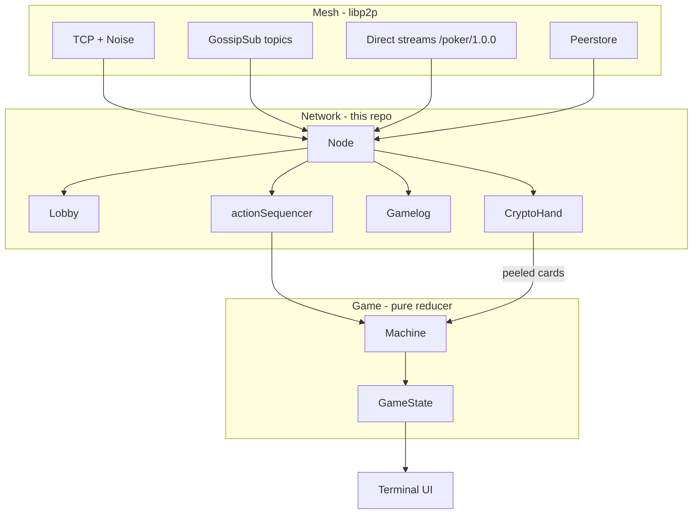
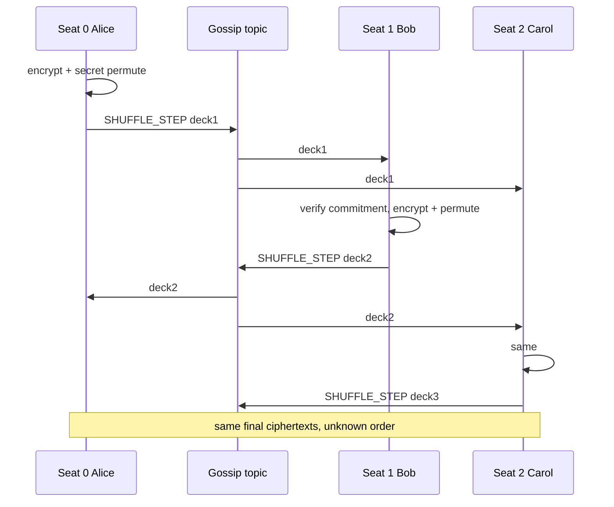

# The Story of a Table With No House

A long, plain-language walk through this repository. It is meant to be read like a book, not like an API reference. Follow four people — Alice, Bob, Carol, and Dave — from the moment Alice types `poker host` until the chips are counted and the next hand begins.

If you get lost, skip to [the one-page map](#the-one-page-map) or [the glossary](#glossary). If a diagram appears, stare at it before the next paragraph. The diagrams are the argument; the words are the footnotes.

**Length note.** Printed, this is roughly forty-five pages. You do not have to read it in one sitting. The chapters are in time order: first the aim, then the machines, then the lobby, then the shuffle, then the cards, then the betting, then the crashes, then what we learned.

**What this file is not.** It is not a replacement for the phase onboarding chapters (`PHASE_1.md` … `PHASE_5.md`). Those teach you which file to open. This file teaches you what is *happening*.

---

## How to read this

Imagine four laptops on one Wi-Fi. Nobody is “the server.” Each laptop runs the same program. Each laptop keeps its own copy of the poker table. They stay in agreement by applying the same events in the same order, and they hide cards with math instead of with a dealer.

Keep three pictures in your head the whole time:

```
┌─────────────────────────────────────────────────────────┐
│  THE MACHINE  (internal/game)                           │
│  A pure Hold’em engine. No sockets. No encryption.      │
│  Same inputs in, same pots out.                         │
└─────────────────────────────────────────────────────────┘
                         ▲
                         │  cards and actions as inputs
                         │
┌─────────────────────────────────────────────────────────┐
│  THE NETWORK  (internal/network)                        │
│  Finds people, signs messages, orders actions,          │
│  runs the shuffle and the peels.                        │
└─────────────────────────────────────────────────────────┘
                         ▲
                         │  bytes on the wire
                         │
┌─────────────────────────────────────────────────────────┐
│  THE MESH  (libp2p)                                     │
│  TCP pipes, Noise encryption, GossipSub topics,         │
│  a phone book called the peerstore.                     │
└─────────────────────────────────────────────────────────┘
```

Whenever something confusing happens — “who shuffled?”, “who sees this card?”, “how does Bob know Alice folded?” — ask: is this the **machine**, the **network**, or the **mesh**?



A fourth picture sits beside them and almost never talks to the first three:

```
┌─────────────────────────────────────────────────────────┐
│  MONEY  (contracts/PokerEscrow.sol)                     │
│  Designed. Tested in Solidity. Not wired into play.     │
│  Chips on the screen today are local counters.          │
└─────────────────────────────────────────────────────────┘
```

---

## Table of contents

1. [The aim](#1-the-aim)
2. [Four people, four programs, one table](#2-four-people-four-programs-one-table)
3. [The two kinds of truth](#3-the-two-kinds-of-truth)
4. [What lives inside one process](#4-what-lives-inside-one-process)
5. [Alice starts as host](#5-alice-starts-as-host)
6. [Broadcast, discovery, and the phone book](#6-broadcast-discovery-and-the-phone-book)
7. [Bob and Carol join](#7-bob-and-carol-join)
8. [How everyone ends up with the same seat order](#8-how-everyone-ends-up-with-the-same-seat-order)
9. [Ready: the barrier before the first card](#9-ready-the-barrier-before-the-first-card)
10. [Two pipes: gossip and direct streams](#10-two-pipes-gossip-and-direct-streams)
11. [The catalogue of keys](#11-the-catalogue-of-keys)
12. [Splitting the private exponent (Shamir)](#12-splitting-the-private-exponent-shamir)
13. [The shuffle, from the first lock to the last mix](#13-the-shuffle-from-the-first-lock-to-the-last-mix)
14. [A tiny deck, so the shuffle is visible](#14-a-tiny-deck-so-the-shuffle-is-visible)
15. [Hole cards: why only you see yours](#15-hole-cards-why-only-you-see-yours)
16. [The engine wakes up](#16-the-engine-wakes-up)
17. [A fold, a raise, and how order is kept](#17-a-fold-a-raise-and-how-order-is-kept)
18. [Cheating by telling two stories](#18-cheating-by-telling-two-stories)
19. [The flop, the turn, the river](#19-the-flop-the-turn-the-river)
20. [What a fold does *not* unlock](#20-what-a-fold-does-not-unlock)
21. [Side pots and all-in, without a cashier](#21-side-pots-and-all-in-without-a-cashier)
22. [What you see: the terminal UI](#22-what-you-see-the-terminal-ui)
23. [Heartbeats: “I am still here”](#23-heartbeats-i-am-still-here)
24. [Carol’s laptop dies](#24-carols-laptop-dies)
25. [When gossip drops a step](#25-when-gossip-drops-a-step)
26. [Showdown](#26-showdown)
27. [The hand ends; the next one begins](#27-the-hand-ends-the-next-one-begins)
28. [Zero-knowledge proofs, in kitchen language](#28-zero-knowledge-proofs-in-kitchen-language)
29. [The maths behind SRA, in kitchen language](#29-the-maths-behind-sra-in-kitchen-language)
30. [Design choices we made on purpose](#30-design-choices-we-made-on-purpose)
31. [Challenges we hit, and what they taught](#31-challenges-we-hit-and-what-they-taught)
32. [Honest limitations](#32-honest-limitations)
33. [The one-page map](#the-one-page-map)
34. [Where each struct lives](#where-each-struct-lives)
35. [Questions you actually asked, answered short](#questions-you-actually-asked-answered-short)
36. [Glossary](#glossary)
37. [A second pass: gossip, host, streams, lobby, log](#a-second-pass-gossip-host-streams-lobby-log)

---

## 1. The aim

A normal online poker site is a **house**. You open a browser. The house shuffles. The house deals. The house tells you whose turn it is. The house pays the winner. You have to trust that the operator did not peek at hole cards, did not stack the deck, will not rewrite the pot, and will stay online.

This project’s aim is a **table with no house**.

That sentence has four jobs inside it:

1. **Play real Texas Hold’em.** Blinds, hole cards, flop / turn / river, check / call / raise / fold / all-in, side pots, seven-card evaluation, more than one hand.
2. **No game server.** `poker host` is only the first laptop to start listening. After the mesh forms, every seated program is equal.
3. **Same public outcome on every honest laptop.** Whose turn it is, how big the pot is, who won — each replica computes this itself from the same ordered list of actions. Nobody “announces the winner” as an authority.
4. **Hidden hole cards without a dealer.** Cards are produced by a cryptographic protocol called **mental poker**. Here that means Shamir–Rivest–Adleman commutative encryption, abbreviated **SRA**. You encrypt, I encrypt, she encrypts. Order of encryption does not matter. Selective unlocking lets only the rightful player see a hole card.

What it is **not** trying to be, on purpose:

- Not a 10,000-player tournament. A table is 3–9 people. Scale would be many independent tables, not a bigger mesh.
- Not Byzantine agreement (PBFT, HotStuff, Raft) on every fold. Honest nodes apply a total order of signed actions. A liar who sends two different folds is **detected after the fact**, not stopped by a vote on every click.
- Not a public-internet product. Discovery is LAN multicast or a copied address. Relays are off.
- Not two-player peer-to-peer. Recovering a missing encryption key after a crash needs at least three seats. Heads-up exists only as you-versus-bots on one process.
- Not live Ethereum. A Solidity escrow contract exists and has tests. The Go program never talks to a chain node. Chips on the screen are counters.

If you remember only one sentence from this chapter: **chips on the screen are not money, and `poker host` is not a game server.**

---

## 2. Four people, four programs, one table

It is Friday. Four friends want to play Hold’em without installing PokerStars and without trusting a website.

| Person | Command they type | Listen port | What they think they are |
|---|---|---|---|
| Alice | `poker host --seats 4 --name Alice --table friday` | TCP 9000 | “I started the table.” |
| Bob | `poker join --name Bob --table friday` | 9000 on his laptop, or 9001 if he shares Alice’s machine | “I joined Alice.” |
| Carol | same idea | | |
| Dave | same idea | | |

Alice is **not** the dealer. She is **not** the referee. She is the first process that bound a port and printed an address. After Bob, Carol, and Dave connect, the four programs are peers. If Alice’s laptop later dies *after* the shuffle, the others can still finish the hand (with some work). If it dies *during* the shuffle, the hand dies too — we will see why.

Each person is running **one OS process**. Inside that process there is no “server thread” and “client thread” in the game-logic sense. The same binary both sends and receives.

There is also a second way to run the binary, which this story mostly ignores until the end: type `poker` with no arguments and play against bots on one machine. No network, no SRA, all cards visible to the process. Useful for testing the rules. Useless for privacy.

---

## 3. The two kinds of truth

Poker has two kinds of facts.

**Public facts** everyone is allowed to know, and everyone *must* agree on:

- who is sitting where
- whose turn it is
- how many chips are in the pot
- that Alice folded
- that the flop is `K♠ 9♦ 2♣` (once it has been dealt)
- who won

**Private facts** only one person may know, until showdown:

- Alice’s two hole cards, on Alice’s screen
- Bob’s two hole cards, on Bob’s screen

The whole architecture is “make the public facts a pure function of a log, and make the private facts a protocol of locks and unlocks.”

```
PUBLIC PATH                              PRIVATE PATH
-----------                              ------------
signed PLAYER_ACTION                     encrypted deck
     │                                        │
     ▼                                        ▼
action sequencer                         shuffle, then peels
     │                                        │
     ▼                                        ▼
game.Machine.ApplyAction                 only you finish your hole
     │                                        │
     ▼                                        ▼
identical GameState                      empty opponent holes
on every honest replica                  until showdown
```

If you mix the two paths — if the host “just deals from a local deck and tells everyone the cards” — you have reinvented a server. The code fights that. `internal/game` is not allowed to import `internal/network`. Networking produces authenticated, ordered **inputs**. The engine **reduces** them.

---

## 4. What lives inside one process

When Alice’s program starts, it is not one blob. It is a small town of packages.

```
cmd/poker/main.go          the mayor: wires everyone, runs the loop
        │
        ├── config/        YAML knobs, identity file on disk
        │
        ├── internal/network/Node
        │       ├── PokerHost     libp2p: identity, listen, TCP, Noise
        │       ├── GossipManager two pub/sub topics
        │       ├── Lobby         who joined, who is ready, seat order
        │       ├── Gamelog       paper trail of signed envelopes
        │       ├── CryptoHand    one hand’s shuffle + peels
        │       └── StreamPool    direct /poker/1.0.0 streams
        │
        ├── internal/crypto/      SRA keys, shuffle FSM, peel FSM, ZK
        ├── internal/game/Machine Hold’em reducer
        ├── internal/fault/       heartbeats, timeout votes, Shamir store
        └── internal/tui/         what Alice stares at in the terminal
```

A few structs you will meet by name. They are not interchangeable.

| Struct | Package | Lives in | Job |
|---|---|---|---|
| `PokerHost` | network | one per process | “I am a peer on the internet.” Peer ID, listen address, connections. |
| `Node` | network | one per process | The player: host + gossip + lobby + log + callbacks. |
| `Lobby` | network | one per table | Seats filling up. Canonical order. Ready barrier. |
| `SeatInfo` | network | one per seated peer, inside Lobby | Name, buy-in, public SRA exponent `e`, join time. |
| `Keyring` | crypto | one per table, after lobby fills | **My** private `d`, everyone else’s public `e` only. |
| `ShuffleSession` | crypto | one per hand | Turn-taking encrypt-and-permute. |
| `DealSession` | crypto | one per hand, after shuffle | Turn-taking peels for holes, streets, showdown. |
| `CryptoHand` | network | one per hand | Wraps shuffle + deal; talks to the wire. |
| `Machine` | game | one per hand | Hold’em rules. |
| `GameState` | game | inside Machine | Phase, stacks, pot, board, whose turn. |
| `Player` | game | inside GameState | Stack, hole cards, folded/all-in/active. |
| `Envelope` | network (proto) | every gossip message | Type, sender, seq, payload, Ed25519 signature. |
| `Gamelog` | network | one per hand | Append-only list of envelopes. Evidence, not consensus. |
| `FaultManager` | fault | one per process after lobby | Heartbeats, votes, key-share store. |
| `actionSequencer` | cmd/poker | one per process | Puts unordered `PLAYER_ACTION`s back in order. |

Notice what is **not** on that list: a `Dealer` type. There is no dealer object. Dealer is only an **index** into the seat list (`DealerIdx`), used so blinds and deal order match real Hold’em.

---

## 5. Alice starts as host

Alice types:

```bash
./poker host --seats 4 --name Alice --table friday
```

A surprising amount happens before anyone else exists.

### 5.1 Identity, already on disk

The program loads `~/.poker/identity.key` (or creates one). That file is a 64-byte **Ed25519** seed. From it, libp2p derives a **Peer ID** that looks like `12D3KooW…`. That string is Alice’s permanent name on the mesh. It is not her display name. Display name is just `"Alice"`.

This Ed25519 key does two jobs that people often mash together:

1. **Who you are on the network.** The Peer ID is a hash of the public key. When Bob dials Alice, Noise (the connection handshake) proves the far end holds that key.
2. **Who authored a gossip message.** Every gossip envelope is signed with the same key. That matters because gossip is forwarded. Bob may receive Alice’s fold from Carol’s laptop. Carol’s encrypted TCP hop only proves “this hop is Carol.” The signature on the envelope proves “Alice wrote this fold.”

### 5.2 A second key, for cards, not for identity

Unless Alice passed `--no-crypto`, the process also generates an **SRA** key pair `(e, d)` modulo a shared 2048-bit prime `p`. This pair is **not** saved to disk. It lives in RAM for this process. `e` will be published in the join message. `d` never leaves Alice’s machine except as Shamir **shares** (pieces), later.

Two keys, two jobs, never mixed:

| Key | Algorithm | Stored? | Published? | Used for |
|---|---|---|---|---|
| Ed25519 | signatures | `identity.key` | public half via Peer ID | “this message is from Alice” |
| SRA `(e, d)` | modular exponentiation | RAM only | only `e` | locking and unlocking cards |

There is a third key in the repo — an Ethereum ECDSA key from `poker keygen` — that play never uses.

### 5.3 Listening is not dealing

`PokerHost` asks libp2p to:

- listen on `/ip4/0.0.0.0/tcp/9000` (accept on every local IPv4 interface, port 9000)
- encrypt each **direct** connection with **Noise**
- use **TCP**
- **not** use relays
- try **UPnP** so a home router might punch a hole (often useless; fine on a LAN)

Then it prints something like:

```
=== P2P Poker  ·  Alice ===
Peer ID  : 12D3KooWabc...

Share one of these addresses with the other player:
  /ip4/192.168.1.100/tcp/9000/p2p/12D3KooWabc...

Table : friday   Seats : 4   Buy-in : 1000 chips

Waiting for players…
```

That long string is a **multiaddr**. Read it left to right: IPv4, this host, TCP, this port, and the peer you should find there is this ID. Bob can paste it into `--peer` if mDNS does not find Alice automatically.

### 5.4 The host applies her own join locally

Alice’s `Node` then **broadcasts** `JOIN_TABLE` on the gossip topic `poker/table/friday`. GossipSub will echo her own message back. The receive loop **ignores self-echo**. So she also applies the join to her own `Lobby` immediately. Otherwise she would wait forever for a copy of herself.

The join payload carries:

- table id (`friday`)
- display name (`Alice`)
- buy-in (`1000`)
- public SRA exponent `e` (empty if `--no-crypto`)
- a session nonce (in this code: her own Peer ID as bytes)

At this moment the lobby has one seat. The table is not “live” as a game. It is a waiting room.

**What was “broadcast”?** Not Ethernet broadcast. Not “shout to the whole Wi-Fi.” It is **publish** on a GossipSub **topic**. Anyone who subscribed to `poker/table/friday` eventually gets a copy. Delivery is best-effort and **unordered**. That last word will matter when people start folding.

---

## 6. Broadcast, discovery, and the phone book

How does Bob even know a game exists?

There is no lobby server, no website listing tables, no DHT. Two mechanisms, both humble.

### 6.1 Same LAN: mDNS

**mDNS** (multicast DNS) is the same family of tricks that lets your laptop find a printer named “Office Laser” without a directory server. This program advertises the service tag `p2p-poker-v1`.

When Bob’s process starts, it also starts mDNS. Alice’s process is already shouting “I speak p2p-poker-v1.” Bob’s stack hears it, gets Alice’s Peer ID and addresses, writes them into the **peerstore**, and dials.

```
        Alice's laptop                    Bob's laptop
        --------------                    ------------
        mDNS: "I am p2p-poker-v1
               at 192.168.1.100:9000
               id 12D3KooWabc"
                    \                         /
                     \   multicast on LAN    /
                      \                     /
                       ▼                   ▼
                    Bob's discovery callback
                    peerstore.AddAddrs(...)
                    Connect(Alice)
```

The peerstore is the “directory” in your question. It is **local**. Each process has its own. It is a map: Peer ID → list of multiaddrs, plus keys. When Alice later connects to Carol, Alice’s peerstore grows. There is no shared cloud directory.

“How are all peers in each other’s directories?” — they are not magically synced. Each laptop fills its own book like this:

```
Time 0   Alice listening. Peerstore: { Alice }
Time 1   Bob mDNS-finds Alice, Connect(Alice).
         Bob's book:   { Bob, Alice }
         Alice's book: { Alice, Bob }
Time 2   Carol finds Alice, Connect(Alice).
         Carol's book: { Carol, Alice }
         Alice now knows Carol. GossipSub membership spreads.
Time 3   Dave same.
Time 4   Bob's GossipSub neighbor set may now include Carol
         even if Bob never typed Carol's multiaddr.
         Direct /poker/1.0.0 to Carol still needs Carol in
         Bob's peerstore — libp2p often learns her addrs from
         the mesh. If a unicast share fails, it is retried.
```

For four people on a LAN this usually becomes a full clique: everyone has a TCP+Noise session to everyone. GossipSub does **not require** that. A message can hop Alice→Carol→Dave. That is why **the hop is not the author**. Signatures travel with the payload.

Think of the peerstore as four separate address books that converge, not one shared Google Doc.

### 6.2 Different network: copy the multiaddr

If Bob is in another building, multicast never reaches him. He must pass:

```bash
./poker join --name Bob --table friday --peer "/ip4/192.168.1.100/tcp/9000/p2p/12D3KooWabc..."
```

That only works if `192.168.1.100` is reachable from Bob — same LAN, or port-forwarded, or UPnP succeeded. This repo has no relays. NAT is a real operational wall, not a solved one.

### 6.3 The table id is a password, not a lock

`--table friday` is just a string that names the GossipSub topic. If Alice hosts `friday` and Bob joins `saturday`, they subscribe to different topics and never see each other’s joins. There is no cryptographic admission control beyond “you have to find the topic and the address.” Anyone who can reach the mesh and guess the table id can try to join. For a LAN among friends, that is the threat model.

### 6.4 How you “know a game is live”

You don’t, globally. There is no matchmaking. You know because:

- you started the host, or
- mDNS found a `p2p-poker-v1` peer, or
- a friend pasted a multiaddr, **and**
- you see `JOIN_TABLE` messages and a seat count climbing toward `--seats`.

Until the lobby is full, there is no shuffling and no `GameState`. “Live” in the poker sense starts after everyone is ready.

There is no “table is open” website. The host’s terminal printing `Waiting for players…` is the closest thing to a lobby screen. Joiners see `[lobby] Bob joined (2 / 4 seats)` as each signed join lands. That print is a courtesy. The real knowledge is `Lobby.Count()`.

---

## 7. Bob and Carol join

Bob’s process is almost the same as Alice’s. Host versus join is a **CLI difference**, not a role difference.

Join does three extra things:

1. Optionally dial `--peer`.
2. Use the same `--table` string.
3. If two processes share one computer, pick a free `--listen` port so they do not both bind 9000.

Then Bob also `BroadcastJoin`s. Alice’s receive loop:

1. Unframes the bytes (4-byte length prefix, then protobuf).
2. Verifies the Ed25519 signature (public key recovered from the Peer ID).
3. Drops replays (per-sender envelope sequence must strictly increase).
4. Appends the envelope to `Gamelog`.
5. `Lobby.HandleJoin`.

Carol and Dave do the same. Each node retries join a few times while the mesh is still forming, because the first publish can happen before GossipSub has peers.

When Alice’s lobby count hits 4, she prints “All 4 players present” and broadcasts **ready**. Bob, Carol, and Dave are in the same wait loop: they poll `Lobby.Count() >= maxSeats`, then they too broadcast ready.

Nobody has shuffled yet. Nobody has a `Machine` yet. The TUI is not up.

---

## 8. How everyone ends up with the same seat order

Maps in Go do not have a stable order. If each laptop iterated `lobby.seats` however it liked, Alice would be dealer on one machine and UTG on another, and the hand would be nonsense.

So `Lobby.Seats()` **sorts**:

1. Earlier `JoinedAtUnixMs` first.
2. If two timestamps are equal, smaller Peer ID string first.

The timestamp is the **sender’s** timestamp from the join envelope, not “when I received it.” That way Alice and Bob, who saw the same signed join, sort the same way — **assuming clocks are close enough**. The README is honest: clock skew can theoretically reorder seats. Honest LAN clocks are the assumption. This is a real design scar. A cleaner design would be “order by a hash of the join signatures” or “host proposes an order, everyone signs it.” Join-time is what shipped.

That sorted list is **canonical seat order**. It is copied into the `Keyring`. It is the order of the shuffle. It is the order of peels. It is the order of `game.Player` pointers. Dealer index 0 means “first in this list,” not “the host.”

```
Join arrivals (maybe gossip-reordered):     After sort:
  Carol's JOIN (ts=200)                       Seat 0 Alice (ts=100)
  Alice's JOIN (ts=100)                       Seat 1 Bob   (ts=150)
  Dave's JOIN  (ts=250)                       Seat 2 Carol (ts=200)
  Bob's JOIN   (ts=150)                       Seat 3 Dave  (ts=250)
```

**Indexes** in this project usually mean one of three things. People mix them up:

| Index | What it orders | Example |
|---|---|---|
| Seat index | People, canonical order | Alice=0, Bob=1, Carol=2, Dave=3 |
| Envelope `seq` | One sender’s gossip messages | Alice’s 1st signed envelope, 2nd, 3rd… |
| `PlayerAction.Seq` | The **global** betting log | Fold is action 1, raise is action 2, … on **every** replica |
| Deck index | Positions in the 52-card encrypted array | Bob’s first hole card might be index 0 |

The deck indexes are **not** random. They follow the same walk as a physical dealer: left of dealer first, two hole cards each, then burn, flop, burn, turn, burn, river. For four players, dealer = seat 0:

| What | Deck indexes |
|---|---|
| Hole round 1 (SB, BB, UTG, dealer) | 0, 1, 2, 3 |
| Hole round 2 | 4, 5, 6, 7 |
| Burn (never peeled) | 8 |
| Flop | 9, 10, 11 |
| Burn | 12 |
| Turn | 13 |
| Burn | 14 |
| River | 15 |

Everyone computes those formulas from `n` and `dealerIdx`. Nobody sends “Bob’s card is index 4” as a privileged fact. If the formula drifted from `Machine.dealHoleCards`, crypto and rules would disagree. That is why `HoleCardIndex` exists: one function, used by the deal session.

---

## 9. Ready: the barrier before the first card

When the lobby is full, each node broadcasts `PLAYER_READY` and marks itself ready locally (same self-echo problem as join). `Lobby.checkAllReady` fires when:

- seat count == max seats, **and**
- every seat has `IsReady == true`

Then it closes a channel. Waiters wake up. There is also a **two-second sleep** so late ready messages can arrive before anyone starts shuffling. That sleep is an engineering shrug, not a proof. A lost ready can stall a node; a slow node can start slightly late. Early shuffle steps are **buffered** until `CryptoHand` exists, which saves you from the worst race.

After ready:

1. Build `game.Player` objects from seats (id, name, buy-in stack).
2. Start `FaultManager` and the heartbeat sender **before** the shuffle. A death during shuffle should still be noticed, even if the hand then aborts.
3. Build the `Keyring` from the lobby.
4. Unicast Shamir shares of `d`.
5. Run the shuffle, then hole peels.
6. Call `StartHandCrypto` with **only local** hole cards filled.
7. Open the TUI.

If any seat joined with `--no-crypto` (empty `e`) while others did not, the table **exits**. Mixed mode would mean some people think cards are secret and some people have a public deck. That is worse than failing loud.

### 9.1 What if four people all click ready at once?

There is no click in the current CLI. Ready is automatic: as soon as a process sees `Count() >= maxSeats`, it broadcasts `PLAYER_READY`. So “they all clicked ready” in this repo means “the fourth join arrived, and four independent loops noticed.”

Picture four stopwatches, not one referee:

```
t=0.00  Dave's JOIN fills the lobby on Alice's laptop
t=0.05  Alice broadcasts READY, marks herself ready locally
t=0.08  Bob's laptop hits the same count, broadcasts READY
t=0.10  Carol same
t=0.12  Dave same
t=0.20  Gossip delivers the four READYs in some scramble
t=0.21  each Lobby.checkAllReady: 4 seats, 4 IsReady flags → close readyCh
t=2.21  two-second sleep ends
t=2.22  Keyring, Shamir unicasts, shuffle
```

If Carol’s ready is delayed two seconds, Alice might finish the sleep with Carol still `IsReady=false` **on Alice’s replica** while Carol has already started shuffling. Early `SHUFFLE_STEP`s are buffered (cap 16) until `CryptoHand` exists. That buffer is how we survive “everyone hit ready at once” without a coordinator.

The ready message is **not** a cryptographic vote. It is a barrier. Lost forever, one node stalls. That is a known LAN-shaped risk.

After the barrier, **everyone starts the same pipeline independently**. There is no “host, please begin.” Seat 0’s `StartShuffle` happens to publish first because the FSM says so, not because Alice is special.

---

## 10. Two pipes: gossip and direct streams

Your question: *is the deck sent on the same stream we established during connection?*

Short answer: **the TCP connection is reused; the deck does not ride a dedicated “deck stream.”** There are two application pipes on top of those connections.

```
                    one TCP + Noise connection
                    (Alice ↔ Bob, long-lived)
                              │
              ┌───────────────┴───────────────┐
              │                               │
     GossipSub (pubsub)              Direct streams
     topics:                         protocol id:
       poker/table/friday              /poker/1.0.0
       poker/heartbeat/friday
              │                               │
     joins, ready, shuffle           Shamir shares of d
     steps, peels (authoritative),   (at table start)
     actions, votes, hand result     hole peels (best-effort extra copy)
```

### 10.1 Gossip (the town square)

`GossipManager` joins two topics. You **publish** a signed `Envelope`. Neighbors forward it. You eventually receive it, possibly from someone who is not the author (`ReceivedFrom` ≠ signer). That is why signatures exist.

Shuffle steps go here. They are large: 52 big integers (up to ~256 bytes each) plus a hash and a nonce — tens of kilobytes, not megabytes. Peels also go here; gossip is **authoritative** for peels. Direct streams try to speed hole peels to the recipient; if they fail, gossip still delivers.

### 10.2 Direct streams (the private letter)

Protocol id `/poker/1.0.0`. A new stream is opened per send in the simple helper; streams are **multiplexed** on the existing TCP connection, so you do not redo the handshake. Noise already authenticates the hop, so these frames are not signature-verified the same way (the comments in `gossip.go` say this out loud).

**Live Shamir shares are never gossiped.** If they were, anyone listening could collect enough pieces to rebuild `d` while the owner is still playing. Shares travel unicast at table start. They are gossiped **only after** a timeout vote has confirmed that owner is gone and the table needs the layer.

### 10.3 Framing

TCP is a byte stream, not messages. Every frame is:

```
[ 4 bytes: length N, big-endian ] [ N bytes: protobuf Envelope ]
```

`N` is capped at 4 MiB so a hostile peer cannot ask you to allocate a gigabyte.

### 10.4 Heartbeat topic

Heartbeats are *published* on `poker/heartbeat/<tableID>` so a huge shuffle step on the table topic should not look like death. That is the design. Today the live receive loop in `Node` drains the **table** topic. The dedicated heartbeat subscription exists; wiring a second receive loop is the last mile. Timeout **votes** still travel on the table topic. Treat “separate heartbeat topic” as the intended isolation, and know the receive path is the kind of detail that bites during liveness testing.

---

## 11. The catalogue of keys

People say “encryption” as if it were one knob. This table uses several tools for several jobs.

| Tool | Where | What it hides or proves | Secret |
|---|---|---|---|
| **Noise** | every direct TCP session | Wi-Fi eavesdropper cannot read the hop | ephemeral session keys |
| **Ed25519** | every gossip envelope | author is this Peer ID; cannot impersonate a seat | `identity.key` |
| **SRA** | cards | commutative lock; peel with `d` | private exponent `d` |
| **SHA-256 commitment** | shuffle step | published deck matches the hash | nonce; permutation never sent |
| **Schnorr-style ZK** | each peel | this peel really used `d`, without revealing `d` | `d` and a random `r` |
| **Shamir sharing** | `d` at table start | any `t` shares rebuild `d`; `t-1` reveal nothing | the polynomial |
| **SHA-256 state root** | gamelog | fingerprint of the ordered evidence | none (public hash) |

None of these is AES-for-everything. AES would hide a deck from the network, but then **someone** must hold the AES key — a dealer. SRA’s point is that **everyone** can lock and **only a subset** can unlock a given card.

### 11.1 Three different “signatures,” easily confused

People say “signed” for three unrelated operations:

1. **Ed25519 sign the envelope.** Proves Alice authored this gossip message. Fast. Small. Used on joins, folds, shuffle steps, peels, votes. Verify with the public key inside the Peer ID.
2. **ZK prove the peel.** Proves this exponentiation used `d`. Not an identity signature. A verifier who never met Dave can still check the equations. Session id is in the hash.
3. **(Future) ECDSA sign the payout digest.** Ethereum keys from `poker keygen`. Would be 2/3 of seated players signing “these chip deltas and this state root.” Not called from `main` today.

Noise is a fourth cousin: it authenticates **this TCP hop**, not **this poker sentence**. Carol can forward Alice’s fold; Noise says the hop is Carol; Ed25519 says the sentence is Alice’s.

---

## 12. Splitting the private exponent (Shamir)

After the keyring exists, and **once per table** (keys do not rotate between hands), each peer splits their own `d`.

**Shamir secret sharing**, kitchen version:

Imagine `d` is a point on a graph at x = 0. You pick a random polynomial of degree `t-1` whose constant term is `d`. You evaluate it at x = 1, 2, …, n. Each other player gets one point. Any `t` points rebuild the unique polynomial, hence `d`. Fewer than `t` points: infinitely many polynomials fit; you learn nothing.

In code (`SplitSecret` in `commit.go`, `SplitAndDistribute` in `fault/shamir.go`):

```
t = max(2, (n+1)/2)     // for n=4, t=2; for n=3, t=2
shares = SplitSecret(d, t, n, p)
```

For four people, Alice keeps share #1 of Alice, and unicasts share #2 to Bob, #3 to Carol, #4 to Dave. Bob does the same with *Bob’s* `d`. After this round, Alice’s `KeyShareStore` holds “my share of Bob,” “my share of Carol,” “my share of Dave,” plus her own share of herself.

```
Alice's RAM                                Bob's RAM
-----------                                ---------
d_Alice  (full)                            d_Bob (full)
share_A of Alice                           share_B of Bob
share_A of Bob   ◄── unicast ──            share_B of Alice
share_A of Carol                           share_B of Carol
share_A of Dave                            share_B of Dave
```

Threshold `t=2` with `n=4` means **any two survivors** can rebuild a missing `d`. That is why P2P needs **at least three seats**: after one drop, two remain, `t=2`, reconstruction still works. At two seats, one drop leaves one share, and the flop is stuck forever behind a dead lock.

Shares are **not** encryption of cards. They are a fire extinguisher for a missing peeler.

---

## 13. The shuffle, from the first lock to the last mix

This is the part that feels like magic. It is not magic. It is “everyone locks, everyone stirs, nobody publishes the stir.”

### 13.1 The deck starts as numbers, not as `A♠`

A card in the engine is an id `0..51`. Cryptography needs a number in the field modulo `p`. Encoding:

```
field(id) = 2^(id+1)  mod p
```

So the **plaintext deck** is fifty-two known numbers, in **sorted id order**. It is not shuffled yet. Every honest replica builds the same plaintext deck from the same prime. There is no “Alice generates a random deck and sends it.” If she did, she would be the dealer.

A **session id** binds this hand: SHA-256 over canonical player ids plus a nonce. The nonce mixes the lobby nonce (concatenation of each seat’s join nonce) and the hand number. Proofs from hand 1 cannot be replayed on hand 2.

### 13.2 Who goes first?

`ShuffleSession` is a turn-taking state machine. Seat 0 shuffles first, then seat 1, then seat 2, then seat 3. If you are not seat 0, `Start()` returns nothing and you wait.

On Alice’s laptop (seat 0), `Start()` **executes locally**:

1. Encrypt every current value with Alice’s `e`: `c → c^e mod p`.
2. Draw a **secret random permutation** of 52 positions from the OS random generator. This slice of integers **never goes on the wire**.
3. Reorder the 52 ciphertexts by that permutation.
4. Commit: SHA-256 over a fixed-width serialization of the output deck plus a random 32-byte nonce.
5. Publish `SHUFFLE_STEP`: output deck + hash + nonce. **No permutation. No input deck.**

Everyone else:

- Rejects a step from the wrong seat or the wrong hand.
- Checks the commitment opens to the published deck (Alice cannot later say “actually I published a different deck”).
- Adopts that output as the new current deck.

Then it is Bob’s turn. He encrypts **Alice’s already-encrypted** numbers with **his** `e`, permutes secretly, commits, publishes. Then Carol. Then Dave.

```
plaintext  [ 2^1, 2^2, …, 2^52 ]     known to all, ordered
     │
     │  Alice: encrypt with e_A, secret perm π_A
     ▼
deck_1     all locked by Alice, order unknown to others
     │
     │  Bob: encrypt with e_B, secret perm π_B
     ▼
deck_2     locked by Alice and Bob
     │
     │  Carol, then Dave, same
     ▼
final      C = (card ^ e_A ^ e_B ^ e_C ^ e_D)  in a secret order
           actually: card^(e_A e_B e_C e_D)  because exponents multiply
```

**Commutativity** is the whole trick. `(m^e_A)^e_B = (m^e_B)^e_A`. When we peel, **order of peeling does not have to match order of shuffling.** We can peel Bob’s layer before Alice’s.

### 13.3 Why is this random?

Because **one honest permutation is enough**. If Alice, Bob, and Carol all pick the identity permutation (cheat, do not mix), Dave’s random mix still randomizes the order. If **all four** collude, they can stack the deck. Mental poker does not survive a conspiracy of the whole table. It survives “I do not trust *you*.”

The commitment does **not** prove the permutation was random. It only binds the bytes Alice published. Fairness is “I never saw your permutation, and you encrypted before I permuted” (and vice versa, layered).

### 13.4 Where does the shuffle originate?

It originates **on seat 0’s machine**, from `CryptoHand.StartShuffle()` → `ShuffleSession.Start()`. Not from a coordinator server. Not from the host-as-role. If Dave happened to join first and became seat 0, Dave would start the shuffle. Host is coincidental.



Gossip can deliver Dave’s step before Bob’s. The session **buffers** future steps in a `pending` map keyed by seat index, then drains when the gap fills. Same idea as the action sequencer.

### 13.5 Why a mid-shuffle disconnect aborts

The permutation lives only in RAM on that laptop. Reconstructing `d` later does **not** reconstruct the permutation. Survivors cannot produce a consistent next deck. `AbortShuffle`. Restart the processes. This is painful and honest.

### 13.6 Time

2048-bit modular exponentiation on 52 cards, four players, is **several seconds**. The TUI says `Shuffling…`. That is expected. Minutes means a step was lost or a peer died.

---

## 14. A tiny deck, so the shuffle is visible

Fifty-two 2048-bit integers are unreadable. Pretend the deck has **three cards** and **two players**, Alice then Bob. The real code uses 52 and 3–9; the algebra is the same.

Plaintext (known to both):

```
index:  0        1        2
value:  2^1=2    2^2=4    2^3=8     (mod a toy prime, say 23)
```

Alice picks `e_A = 3`. She encrypts each: `2^3=8`, `4^3=64≡18`, `8^3=512≡6` (mod 23). Then she draws a secret permutation, say swap 0 and 2:

```
Alice publishes (no perm on the wire):
index:  0    1    2
value:  6    18   8
+ SHA-256(those bytes || nonce)
```

Bob receives that, checks the hash, adopts it. He encrypts with `e_B = 5`, then permutes, say rotate left:

```
after Bob encrypt:  6^5 , 18^5 , 8^5     (still mod 23)
after Bob permute:  [pos1, pos2, pos0]
Bob publishes that array + commitment.
```

Now neither knows which ciphertext is “the 2.” Both hold the **same** three numbers. To deal index 0 to Alice, Bob peels his layer on the wire; Alice peels hers at home. To deal a community card, both peel on the wire.

Scale that picture to 52 cards and four exponents. That is the real shuffle. The permutation is a Fisher–Yates of 52 indexes seeded from `crypto/rand`, not from a shared seed. If it were a shared seed, anyone could replay the mix. That is exactly what `--no-crypto` does, on purpose, for debugging.

---

## 15. Hole cards: why only you see yours

After the shuffle, every replica holds the **same** 52 ciphertexts. Nobody knows which ciphertext is the ace of spades. Nobody can decrypt fully, because four layers remain.

Dealing is not “send Bob two cards.” Dealing is “peel all layers except Bob’s, on the two indexes that belong to Bob; Bob peels the last layer in his kitchen, with the blinds closed.”

### 15.1 Peel order for a hole card

Take Bob’s first hole card, deck index `i`. Recipient = Bob.

`PeelOrder(seats, recipient=Bob)` = everyone **except Bob**, in canonical order: Alice, Carol, Dave.

Each of those three, when it is their turn:

1. Take the current ciphertext `C`.
2. Compute `C' = C^d mod p` (one layer off).
3. Build a ZK proof that this exponentiation used their `d`.
4. Publish `PARTIAL_DECRYPT`: card index, input `C`, output `C'`, proof.

Alice’s replica verifies Carol’s proof, adopts `C'`, waits for Dave, and so on. After three peels, only Bob’s layer remains. **Bob does not publish the last decrypt.** He runs it locally (`FinishHole` / `LocalKey().Decrypt`). His TUI shows `K♥ 9♣`. Alice’s replica stores Bob’s hole slots as **empty**. Alice still sees a leftover ciphertext she cannot peel, because she does not have `d_Bob`.

```
encrypted card C = m ^ (e_A e_B e_C e_D)

Alice peels:   C1 = C  ^ d_A     now missing only B,C,D layers
Carol peels:   C2 = C1 ^ d_C
Dave peels:    C3 = C2 ^ d_D     now only Bob's layer left
Bob locally:   m  = C3 ^ d_B     NOT published
```

That is the entire privacy model for hole cards. The TUI *also* refuses to draw opponent holes unless local or winner. That hide is belt-and-suspenders. The real privacy is empty slots in `Player.HoleCards`.

### 15.2 Two rounds

Same as a physical deal: around the table twice. For four players, eight hole peels (each with three published peels plus one local finish). Then `HolesDone` is true.

`dealCryptoHand` then fills **only** `localID`’s two cards on `GameState`, leaves others empty, constructs `Machine` with `rng = nil`, calls `StartHandCrypto`. Crypto mode sets `Deck = nil` so the engine **cannot** deal from a local deck later. Streets will be inputs.

### 15.3 Same stream or not?

Peels are gossiped on the **table topic** (authoritative). A copy is also pushed on `/poker/1.0.0` streams to each other seat (best-effort). The Noise TCP connection is the same family of connections opened at join time; it is not a new kind of network. It is a different **application channel**.

---

## 16. The engine wakes up

Until now, `internal/game` has been asleep. Cards were a crypto problem. Now they become a poker problem.

`StartHandCrypto`:

- refuses to shuffle
- posts blinds from stacks (SB, BB)
- sets `ActionIdx` to the first player who can act after the big blind (UTG in a four-handed game: Dave)
- sets phase to **PreFlop**
- leaves `Deck` nil

Alice’s screen shows her two cards. Bob’s shows his. Each screen shows opponents as face-down. The pot has 15 chips. Dave’s panel is highlighted: it is his turn.

**Whose turn** is not a message. It is a function of `GameState`. Every replica computed the same blinds, so every replica highlights Dave.

---

## 17. A fold, a raise, and how order is kept

Dave presses `f`. What happens?

### 17.1 Local apply, then broadcast

On Dave’s process, the TUI callback `applyAndBroadcast`:

1. Locks the machine mutex.
2. Reserves the next **global action sequence number** (`actionSequencer.nextSeq`, starting at 1).
3. `Machine.ApplyAction({Dave, Fold})` immediately. Dave’s replica must not wait for the network to tell Dave that Dave folded — he would freeze.
4. Unlocks.
5. `BroadcastAction` → gossip `PLAYER_ACTION` with that `Seq`.
6. Kicks crypto advance (no-op during betting).
7. Paints the TUI.

On Alice’s process, the receive goroutine:

1. Decodes and verifies the envelope.
2. Hands the payload to `OnPlayerAction`.
3. `actionSequencer.push`. If this is `Seq == 1`, apply now. If this is `Seq == 3` and 2 has not arrived, **buffer**. When 2 arrives, drain 2 then 3.

```
Gossip may deliver:     Sequencer releases:
  action 3 (Alice raise)     (wait)
  action 1 (Dave fold)       apply 1
  action 2 (Bob call)        apply 2, then 3
```

If Alice applied 3 before 1, her pot would diverge from Bob’s forever. **Gossip delivers bytes. It does not deliver a total order.** The sequencer is the application’s answer.

There are **two sequence spaces**. Mixing them is a classic bug:

| Counter | Scope | Job |
|---|---|---|
| `Envelope.seq` | per sender | replay protection; Alice’s 5th gossip message |
| `PlayerAction.Seq` | global, per hand | total order of betting; everyone’s 5th *action* |

Dave’s fold might be envelope seq 40 (after joins, shuffle steps, peels) and action seq 1.

### 17.2 Where is the action stored?

Three places, none of them “the server’s database”:

1. `GameState.Log` — the engine’s list of `Action` structs. Used to replay the hand in memory.
2. `Gamelog` — every authenticated **envelope**, including shuffle and peels. Fingerprinted by `StateRoot()` (SHA-256 over type, sender, seq, payload, signature). Intended as the on-chain evidence blob someday.
3. Each replica’s RAM. There is no disk journal of the hand in the live path.

`HAND_RESULT` is gossiped at settle. It is **informational**. Honest nodes already paid the pots locally. If a `HAND_RESULT` disagreed with local `GameState`, you should not trust the message; you should trust the reducer. (The live loop currently treats it as a log line.)

### 17.3 The acting player is the sequencer’s clock

Because the acting player applies first and stamps `Seq`, they are the one who **allocates** the next number. Remote replicas do not pick a seq; they wait for it. Two people cannot legally act at once — the engine rejects “not your turn.” That is how you avoid two sequencers.

---

## 18. Cheating by telling two stories

Suppose Dave sends Alice “I fold” as action seq 1, and sends Bob “I raise 50” as action seq 1. That is **equivocation**: same sender, same envelope seq (or same action seq), two payloads.

`Gamelog.DetectEquivocation` walks the log looking for `(sender, envelope seq)` with two different payloads. Both signatures are evidence: Dave signed both lies. Every 5 seconds `equivocationScanLoop` looks. A slash record can be stored (`SlashEquivocation`).

This does **not** prevent the split-brain. If Alice applied fold and Bob applied raise, their machines already diverged. Detection is after the fact. That is the “not BFT” choice: we did not run a quorum round on every fold, because a 4-player LAN table would feel like molasses, and the threat model is “friends on a LAN plus signed evidence,” not “nation-state in the mesh.”

If you want prevention, you need consensus (or a server). This project chose detection plus optional future slashing.

---

## 19. The flop, the turn, the river

Betting continues until the round is complete (everyone matched, or everyone all-in, or one player left). In crypto mode, `endBettingRound` does **not** deal. It sets `PhaseAwaitingStreet` and returns. The engine is now waiting for cards as **inputs**.

`AdvanceCryptoLocked` notices `NeedsStreet()`, maps board length to flop/turn/river, and starts a **public peel**.

Public peel: recipient is empty. **Everyone** peels, including the player whose hole card this is not. After four peels the value is plaintext. `FinishPublic` maps the field element back to a `Card` by testing `2^1 … 2^52`. `ApplyStreet` appends the three flop cards (or one turn, or one river) and starts the next betting round.

Burns are **skipped indexes**. Nobody peels index 8. It stays encrypted forever. That matches a physical burn: removed from play, never shown.

```
Preflop betting ends
        │
        ▼
PhaseAwaitingStreet
        │
        ▼
public peel indexes 9,10,11  (everyone peels each)
        │
        ▼
ApplyStreet([K♠, 9♦, 2♣])
        │
        ▼
PhaseFlop, new betting round
```

Waits for peels run **without** holding the machine mutex, so a timeout fold can still take the lock. That is a concurrency lesson paid for in deadlocks.

Community cards are public because **every layer came off on the wire**. Hole cards stayed private because **one layer never came off on the wire**.

---

## 20. What a fold does *not* unlock

This is the question that sounds like a protocol bug until you sit with it.

When Bob folds:

- `Player.Status = Folded`
- he cannot win the pot
- at showdown, his hole **indexes are not publicly peeled** (fold-to-winner skips reveals; multi-way showdown only reveals remaining players)
- his encryption **layer is still on every remaining ciphertext**

Bob folding does **not** remove `e_Bob` from the flop. The flop still needs Bob’s peel (or, if Bob has disconnected, a reconstructed `d_Bob` used by a survivor). A fold is a **poker** fact. A peel is a **crypto** fact. They meet only at showdown (don’t reveal a folder) and at disconnect (folder-or-not, if he holds a layer the table still needs, someone must peel for him).

There is no “unlock everyone’s cards when I fold” message. Unused encrypted cards simply stay unused. Bob’s holes stay locked. That is what you want.

If Bob is **still online** after folding, he still participates in public peels for the flop. He is no longer betting; he is still a lock-holder. Mental poker makes spectators cryptographically load-bearing. That feels weird and is correct.

```
Bob folds
   │
   ├─ poker path:  Status=Folded, skip him in betting, skip his
   │               holes at showdown, he cannot win pots
   │
   └─ crypto path: e_Bob still multiplies every ciphertext
                   flop still needs a Bob-peel (or reconstructed d)
                   his hole indexes stay locked unless revealed
```

Two locks, two keys. Do not melt them into one sentence.

---

## 21. Side pots and all-in, without a cashier

Hold’em with four stacks is not “one pile, best hand wins.” If Dave is all-in for 40 and Alice raises to 200, Dave can only contest 40 from each caller. The extra belongs to a **side pot**.

`CalculatePots` does not care who raised. It sorts players by `TotalBet` (how much they have put in this hand), then peels contribution **layers**:

```
Alice put in 200, Bob 200, Carol 80 (all-in), Dave 40 (all-in)

Layer 1: everyone paid 40 → main pot 160, all four eligible
Layer 2: Alice, Bob, Carol paid 40 more → side 120, those three
Layer 3: Alice and Bob paid 120 more → side 240, those two
```

Identical eligibility layers merge. At showdown each pot is awarded to the best **eligible** hand. A folder is not eligible even if they contributed (their chips stay; they cannot win). The engine does this on every replica from the same stacks. Nobody broadcasts “Carol wins the side pot.” They all compute it.

All-in is an `ActionAllIn`. It may also reopen betting if it is a raise. After that, `CanAct()` is false for that seat; the round can complete without waiting for them. Crypto still needs their peels if they are online.

There is no cashier process. Stacks are `int64` fields. If you later hook escrow, the **deltas** (who won how much this session) are what the contract should see, not each all-in.

---

## 22. What you see: the terminal UI

Package `internal/tui`. Charm **Bubble Tea**: a model, an update function, a view. The view is a pure function of `GameState` plus “which Peer ID am I?”

```
┌────────── Alice (you) ──┐  ┌────────── Bob ──────────┐
│  K♥  9♣                 │  │  ░░  ░░                 │
│  $980  BB               │  │  $990  SB               │
└─────────────────────────┘  └─────────────────────────┘
         board:  K♠  9♦  2♣           pot $45
┌────────── Carol ────────┐  ┌────────── Dave FOLDED ─┐
│  ░░  ░░                 │  │  ░░  ░░                 │
│  $1000                  │  │  $990                   │
└─────────────────────────┘  └─────────────────────────┘
  [ fold ]  [ call ]  [ raise ]  [ all-in ]
```

Opponent holes render face-down unless `IsLocalPlayer` or `IsWinner`. That is **defense in depth**. On the default crypto path, opponent `HoleCards` are empty until reveal, so even a buggy panel has nothing to print — unless you launched `--no-crypto`.

Keys: `f` fold, `c` check/call, `r` raise, `a` all-in, arrows, Enter, `q` quit. A keypress does not edit the engine inside the TUI. It calls `applyAndBroadcast`. A 250 ms tick plus a notify channel keep the screen fresh when a remote action lands.

The TUI is how humans meet the replica. It is not where rules live. If the panel and the pot disagree, believe `Machine`.

---

## 23. Heartbeats: “I am still here”

Silence is ambiguous. Did Dave go to the bathroom, or did his Wi-Fi die?

Each process runs a `HeartbeatSender` on a ticker (default **5 seconds**). It publishes `HEARTBEAT` with a per-sender heartbeat seq, on the heartbeat topic, as a signed envelope.

Each process’s `HeartbeatMonitor` tracks `LastSeen` per **other** peer. After **15 seconds** without a beat, status becomes TimedOut and `OnTimeout` fires → a timeout vote starts.

```
every 5s:  Alice --HEARTBEAT--> topic --> Bob, Carol, Dave update LastSeen(Alice)

if 15s quiet:  Bob starts vote "Alice timed out"
               Carol, Dave vote
               at ⌈(n-1)·2/3⌉ yes votes, confirm
```

**Is everyone sending heartbeat to everyone?** Effectively yes: everyone publishes, everyone who receives updates that sender. It is not a full mesh of unicast pings. It is pub/sub. One publish, many subscribers.

**Through which stream?** GossipSub heartbeat topic, not `/poker/1.0.0`, not a custom UDP ping. Same Noise/TCP underlay as everything else.

A separate topic is so a 40 KB shuffle step clogging the table topic should not look like a crash. (See §10.4 for the receive-loop caveat.)

Votes themselves are `TIMEOUT_VOTE` on the **table** topic: “I, Bob, vote that Alice is silent this hand.” Threshold for n=4: total voters = 3, two-thirds rounded ≈ 2. Two of three yes votes confirm.

---

## 24. Carol’s laptop dies

Two very different stories, depending on **when**.

### 24.1 During shuffle

Carol’s secret permutation is gone. Reconstruction of `d_Carol` does not help. `forceFold` path sees `!ShuffleDone()`, calls `AbortShuffle`, TUI error, hand dead. Restart all processes. We learned this the hard way: people wanted “always recover,” but you cannot recover entropy you never shared.

### 24.2 After shuffle, during betting or peels

Timeout confirms. Then:

1. **Force-fold on the machine, and broadcast that fold as a `PLAYER_ACTION`.** A local-only fold would desync stacks. The fold must go through the sequencer on every replica.
2. Survivors **gossip** their Shamir share of Carol’s `d` (now it is appropriate: she is gone).
3. When `t` shares exist, `TryReconstructKey` rebuilds `(e, d)` for Carol.
4. That key is stored on `CryptoHand.MarkGone`, **not** stuffed into the Keyring. The Keyring’s invariant is “no API returns another peer’s `d`” during honest play. The reconstructed key is a **crisis object**.
5. **Designated survivor** = first remaining id in seat order. That peer, whenever `DealSession` expects Carol’s peel, calls `PeelOnBehalf(Carol, reconstructedKey)` and publishes a `PARTIAL_DECRYPT` whose `PlayerID` is Carol.

The flop can finish. Carol cannot rejoin mid-hand. `GAME_STATE_SYNC` exists in the protobuf and is unused. Restart the table for a new session if you want her back.

```
Carol silent
    → heartbeats stop
    → 2/3 timeout votes
    → broadcast Fold as sequenced action
    → gossip shares of d_Carol
    → reconstruct d_Carol
    → designated survivor peels Carol's layers
    → hand continues without her
```

This is why folding a disconnected player is not enough by itself. **Folding stops her winning. Reconstruction stops the deck deadlock.**

---

## 25. When gossip drops a step

GossipSub is best-effort. Lost messages happen. The project’s answers are uneven, and that is part of the story.

| Lost thing | What happens |
|---|---|
| Join | Retry a few times at start. If still lost, lobby never fills on that node. |
| Ready | Barrier never closes, or one node starts late; shuffle buffer may save it. |
| Shuffle step | `WaitShuffle` times out at **two minutes**, then error. No retransmit in the live loop. Restart. |
| Peel | Same family of waits. Duplicates are ignored if they match. Conflicting duplicates abort that step. |
| Player action | Sequencer waits forever for that `Seq`. The table looks frozen. Heartbeat may eventually timeout-fold the actor — if liveness is working. |
| Heartbeat | After 15s, vote. |
| `HAND_RESULT` | Cosmetic. Pots already local. |

There is no NAK/ACK protocol for shuffle steps. That is a product gap we learned by staring at `Shuffling…` for minutes. The honest workaround today: restart the three (or four) processes. A future version could re-request `nextIndex`’s step from the expected player. The FSM already knows who that is (`ExpectedPlayer()`).

Duplicates are easier than losses. The same shuffle message twice: if it equals the applied one, ignore; if it conflicts, error (equivocation-shaped). Peels the same.

---

## 26. Showdown

If more than one player remains after the river, phase becomes Showdown and the engine waits for `ApplyHoleReveal` until every remaining seat has holes.

**Order of reveals is table seat order, the same on every replica** (`RemainingShowdownIDs`). You must not peel “whoever I am missing locally.” Alice already has Alice’s holes, so `MissingRevealIDs()` on Alice’s machine would skip Alice and start with Bob; Bob’s machine would skip Bob and start with Alice. Then `ApplyHoleReveal` order diverges and pots disagree. That bug has a name in the comments. We learned it by watching two honest replicas disagree after a “perfect” protocol.

Each reveal is a **public peel** of that player’s two hole indexes. After four peels, everyone sees `K♥ 9♣`. The TUI draws them face-up for winners.

Then `EvaluateBest7`: two holes plus five board, best five-card rank, kickers. Side pots from `CalculatePots`: layers of contribution. All-in for less creates a side pot the short stack cannot win beyond what they put in. Payouts are local. `HAND_RESULT` is a postcard.

If everyone but Alice folded, **no reveal**. Alice wins the pot. Opponents’ holes stay locked. Curiosity is not a protocol step.

---

## 27. The hand ends; the next one begins

After three seconds of winner screen, `startNextHand`:

- `handNum++`
- dealer index rotates: `(dealerIdx + 1) % n`
- each `Player.ResetForNewHand()`: holes cleared, status Active, bets zero. **Stack persists.**
- action sequencer reset to seq 1
- lobby reset to waiting (ready channel reopened)
- **new** `CryptoHand`, **new** shuffle, **same** SRA keys, session id mixes the new `handNum`

Keys do not rotate so Shamir shares from table start still match. Session id changes so ZK proofs cannot be replayed.

### 27.1 Someone ran out of chips

The engine has a `StatusSittingOut` and the TUI can badge it. The live next-hand path currently **reactivates everyone** with `ResetForNewHand`. A busted player with stack 0 will fail to post blinds on the next `StartHandCrypto` / `postBlinds` if it is their blind. There is no tournament elimination loop, no cash-out, no auto-sit-out on zero. Demo chips are honor-system counters; “busted” is a real poker concept the reducer understands in-hand (all-in, side pots) more than between hands.

If you add real money later, busted-and-rebuy belongs in escrow plus a lobby rule, not as a silent stack wrap.

### 27.2 Local mode (the other story)

`poker` with no args: one `Machine`, plaintext `StartHand`, bots that check/call after 600 ms, same TUI. Fisher–Yates shuffle from `math/rand`. Fine for learning `ApplyAction`. It will not teach you SRA.

`--no-crypto` on a real mesh: every node mixes the concatenated join nonces into an `int64` seed, Fisher–Yates the same way, `StartHand` fills **all** holes on **every** replica. Fast. Zero privacy. All four laptops can print the whole deck. Use it to test the sequencer without waiting for 2048-bit math.

---

## 28. Zero-knowledge proofs, in kitchen language

A peel is two big integers: input ciphertext and output. Without a proof, Dave can publish garbage, freeze the flop, or try to steer a community card toward a value he likes.

A **zero-knowledge proof** here means: Dave proves “I raised this number to the power of my secret `d`” without showing `d`.

Kitchen analogy: you want to prove you know the combination of a padlock without opening it in front of me. You might put the lock in a box, spin the dials behind a screen, and show me it opened. I learn that you knew the combination. I do not learn the numbers.

The actual math is a **Schnorr-style proof of discrete exponentiation**, made non-interactive with **Fiat–Shamir** (hash instead of a verifier’s random question).

Dave has `d`. Ciphertext `C`, result `R = C^d mod p`. Shared generator `g = 2`.

1. Publish `h = g^d mod p` (a public handle for `d`, not `d` itself).
2. Pick random `r`. Publish `A = g^r`, `B = C^r`.
3. Challenge `c = SHA256(p, h, C, R, A, B, sessionID) mod (p-1)`.
4. Response `s = r + c·d  (mod p-1)`.
5. Verifier checks:
   - `g^s  ==  h^c · A     (mod p)`
   - `C^s  ==  R^c · B     (mod p)`

If Dave used a fake `R`, he cannot find an `s` that satisfies both unless he can break the hash or the discrete log. The session id is inside the hash so a proof from another hand does not verify.

Failed proof → `SlashBadZKProof` record. In the live loop it is logged. It is not submitted on-chain, because the chain client is a stub.

You do not need to memorize the equations. You need the sentence: **anyone can check that this peel used the claimed `d` without learning `d`.**

---

## 29. The maths behind SRA, in kitchen language

**RSA**, the famous one, uses `n = p·q` and a public `e`. **SRA** (Shamir–Rivest–Adleman *mental poker*) uses a **shared prime modulus** `p` so that encryption commutes across players who picked different exponents.

Each player picks `e` coprime to `p-1`, and `d` with `e·d ≡ 1 (mod p-1)`. Then:

```
Encrypt:  c = m^e  mod p
Decrypt:  m = c^d  mod p
```

Because `(m^{e1})^{e2} = m^{e1 e2} = (m^{e2})^{e1}`, Alice’s lock and Bob’s lock commute.

The shared `p` is a well-known 2048-bit MODP prime (the hex blob in `params.go`). Everyone uses the same `p` so everyone’s ciphertexts live in the same field.

**What SRA does not give you:**

- It does not hide the *fact* that a shuffle step happened.
- It does not, by itself, prove a permutation was random.
- Security against “I encrypt a guessed card and compare” is why cards are encoded as `2^{id+1}` and why you never decrypt a hole card in public until showdown.
- 2048-bit exponentiation is slow. That slowness is why shuffle takes seconds.

Ed25519 is elliptic-curve signatures, a completely different animal: small keys, fast, used for **who said this**, not for **what card is this**.

Noise is a handshake pattern that sets up hop encryption. Again different: **this TCP session is private**, not **this card is private from other players**. Other players *must* see shuffle ciphertexts. Noise only hides them from the coffee-shop Wi-Fi.

---

## 30. Design choices we made on purpose

These are not accidents. They are the shape of the project.

**1. The host is a bootstrap, not a brain.**  
Someone must listen first. After that, equality. If you “just add a server” in `cmd/poker`, you fight the whole design.

**2. The engine never deals in crypto mode.**  
`Deck == nil`. Streets and reveals are inputs. That is the only way four laptops compute the same winner without sharing a random generator for cards.

**3. Replicated state machine, not blob sync.**  
We do not send `GameState` every tick. We send actions. `GAME_STATE_SYNC` is a proto fossil. Catch-up is unused; disconnect is fold.

**4. Detect equivocation; do not run BFT.**  
Signed logs plus a scanner. Cheap. Honest-LAN shaped. Not a blockchain.

**5. Gossip for public protocol steps; unicast for live secrets.**  
Shuffle and peels must be public so every replica can verify. Shamir shares of a *living* `d` must not be public.

**6. One honest permuter randomizes the deck.**  
We accepted “all players colluding can stack.” That is the mental-poker bargain.

**7. Timeout fold plus Shamir, but only after shuffle.**  
Liveness for peels. Honesty about permutations.

**8. Money off the hot path.**  
Poker cannot wait for block time. Escrow should judge **payouts and evidence**, never cards. The Solidity is real so the split of concerns is already written down, even though Go never calls it.

**9. P2P minimum three seats.**  
Not a product preference. Arithmetic of Shamir after one crash.

**10. TUI is a subscriber.**  
Keystrokes become `Action` callbacks. The view is a function of `GameState`. The rules do not live in Bubble Tea.

---

## 31. Challenges we hit, and what they taught

This section is the “we learned” part of the story. The scars are in comments and in `ISSUES_AND_RECOMMENDATIONS.md` (some of that file is stale; prefer this list against the live code).

**Self-echo.** GossipSub returns your own publish. If join only happened on receive, you would never sit at your own table. Lesson: apply locally, ignore self on receive. Same pattern for ready, and for the acting player’s action.

**Unordered gossip.** The first mesh demo desynced pots. Lesson: an application sequencer, not “TCP is ordered” (TCP is ordered **per hop**, not across an overlay).

**Two sequence numbers.** Envelope seq and action seq. Mixing them made replays look like folds. Lesson: name them out loud; never reuse.

**Callbacks before Start.** The receive loop starts immediately. Early `SHUFFLE_STEP` into a nil handler is a silent drop. Lesson: wire `OnXxx` first; buffer until `CryptoHand` exists.

**Lobby max seats hardcoded to 9.** Tables of 3 never thought they were full. Lesson: configuration must reach the lobby constructor. (Fixed.)

**Mutex vs peel waits.** Holding `machineMu` while waiting for the flop deadlocked timeout folds. Lesson: `AdvanceCryptoLocked` releases during `WaitStreet` / `WaitReveal`.

**Showdown order.** Replica-local “who am I missing?” is not a global order. Lesson: reveal in canonical seat order always.

**Keyring invariant.** Test helpers (`CryptoGame`) hold every `d` on one machine. If you copy that into the live path, you have a dealer again. Lesson: `Keyring` has no getter for anyone else’s `d`. Reconstruction lives on `CryptoHand.gone`.

**Mid-shuffle recovery is a fantasy.** Users asked. Math said no. Lesson: abort, don’t fake it.

**Mixed `--no-crypto`.** One plaintext peer sees all cards and still talks to crypto peers. Lesson: refuse the table.

**Commitment ≠ fairness proof.** Easy to oversell. Lesson: say what the hash binds (the published deck), not what it randomizes (nothing).

**Clock-skew seats.** Join timestamps are not a consensus clock. Lesson: documented limitation; fine on a LAN; wrong for strangers on the internet.

**Shuffle is slow.** People thought the program hung. Lesson: print `Shuffling…`; 2048-bit is a product constraint, not a bug.

**Heartbeats vs heavy topics.** Isolation is the right idea; the last receive-loop wire is easy to forget. Lesson: a liveness channel nobody reads is a silent channel.

**Escrow temptation.** Wiring ETH before the table was stable would have mixed money bugs with poker bugs. Lesson: chips first, chain later, and never put cards on-chain.

**Windows mDNS tests flake.** Multicast on one PC is cursed. Lesson: fake in-process bus for protocol tests; three real terminals for acceptance.

---

## 32. Honest limitations

Say these out loud so the story does not become a sales pitch.

1. **3–9 seats on P2P.** Not 2.
2. **Disconnect is fold, no rejoin.** Restart the table.
3. **Disconnect during shuffle aborts the hand.**
4. **No live ETH.** Contract yes; Go RPC no.
5. **LAN or a reachable multiaddr.** No DHT, no relays.
6. **One table.** No tournaments.
7. **Not BFT.** Equivocation detected, not prevented.
8. **Seat order uses join timestamps.**
9. **No mid-hand catch-up.** Late joiner cannot splice into a hand.
10. **Busted-stack sit-out between hands is not a finished product loop.**
11. **Shamir threshold `(n+1)/2` with n=4 is t=2.** Two colluding survivors can reconstruct a living player’s `d` if they also steal the protocol — shares of a living player are only safe if they stay unicast and the owner stays. After timeout, reconstruction is the point.

---

## The one-page map

```
 FIND          MESH              PUBLIC LOG              PRIVATE CARDS
 ----          ----              ----------              -------------
 mDNS     →    TCP+Noise    →    signed Envelope    →    SRA shuffle
 --peer        GossipSub         actionSequencer         hole peels
               /poker/1.0.0      game.Machine            public peels
                                 Gamelog                 ZK on every peel

 Alice types host
    → listen, print multiaddr, JOIN
 Bob/Carol/Dave JOIN
    → same Lobby sort on every honest node
 all READY
    → Keyring (my d, their e)
    → unicast Shamir shares
    → seat 0 encrypts+permutes, then 1, 2, 3
    → peels for holes (everyone but recipient on wire)
    → StartHandCrypto (local holes only)
 Dave folds
    → ApplyAction locally, gossip Seq=1
    → others sequencer-apply
 flop
    → PhaseAwaitingStreet → everyone peels → ApplyStreet
 Carol dies after shuffle
    → timeout votes → force fold + reconstruct d → PeelOnBehalf
 river → showdown peels in seat order → pots locally
 next hand: new shuffle, same keys
```

---

## Where each struct lives

Read this when you are holding a name and cannot remember the room.

**Inside `internal/game` (no network):**

- `Card`, `Deck` — ids 0..51; plaintext shuffle only
- `Player` — stack, holes, status
- `GameState` — the public table
- `Machine` — `ApplyAction`, `StartHand` / `StartHandCrypto`, `ApplyStreet`, `ApplyHoleReveal`
- `PotSlice` — main and side pots
- `EvaluatedHand` — best five of seven

**Inside `internal/crypto`:**

- `SRAKey` — `E`, `D`, `P`
- `Keyring` — local private + public map + seat order
- `Commitment` — hash + nonce
- `ShuffleStep` / `ShuffleMessage` / `ShuffleSession` / `ShuffleProtocol`
- `EncryptedDeck` — 52 ciphertexts + session id
- `ZKProof` — `A, B, S, H`
- `PartialDecryption` / `PeelMessage` / `DealSession` / `DealProtocol`
- `ShamirShare` — index + value

**Inside `internal/network`:**

- `Envelope` and every `MsgType` payload (`messages.proto`)
- `PokerHost`, `GossipManager`, `Lobby`, `SeatInfo`, `Node`
- `Gamelog`
- `CryptoHand` — production wrapper
- `StreamPool`
- `HandCoordinator` / in-process helpers — tests, not live host/join

**Inside `internal/fault`:**

- `HeartbeatMonitor`, `HeartbeatSender`
- `TimeoutVote`, `TimeoutManager`
- `KeyShareStore`
- `SlashRecord`, `SlashDetector`
- `FaultManager` — composes the above

**Inside `cmd/poker`:**

- `actionSequencer`
- `p2pGameModel` — TUI + machine pointer + crypto advance
- `runP2PMode`, `dealCryptoHand`, `runLocalMode`

**Inside `internal/tui`:**

- Bubble Tea `Model` — draws `GameState`; hides opponent holes

**Inside `contracts/`:**

- `PokerEscrow` — buy-in, 2/3 signed outcome, challenge, slash burn 20%

---

## A full hand, as a comic strip

You now have the pieces. Here is Friday night in order, compressed.

1. Alice hosts. Peer ID printed. Lobby size 1.
2. mDNS or a pasted multiaddr. Bob joins. Carol joins. Dave joins.
3. Four `JOIN_TABLE`s, each with `e`. Sorted seats: Alice, Bob, Carol, Dave.
4. Four `PLAYER_READY`s. Two-second pause.
5. Each splits `d`, unicasts shares.
6. Heartbeat tickers start.
7. Alice publishes shuffle step 1. Bob 2. Carol 3. Dave 4. Several seconds. Same encrypted deck on four laptops.
8. Eight hole-card jobs. For Alice’s first card, Bob+Carol+Dave peel on the wire; Alice finishes at home. Same for each seat.
9. Each TUI shows two private cards. Blinds posted. Dave to act.
10. Dave folds (seq 1). Bob calls (seq 2). Carol raises (seq 3). Alice calls. Bob calls.
11. Engine waits for streets. Public peels for the flop. Board appears identically.
12. More betting. Turn. River.
13. Showdown: remaining holes peeled in seat order. Pots computed four times, same answer.
14. Postcard `HAND_RESULT`. Three-second winner banner.
15. Dealer button moves. New shuffle. Same keys. Stacks carry over.

If at step 12 Carol’s laptop dies: votes, fold, shares, designated survivor peels her layers, hand still ends.

If at step 7 Carol dies: abort. Go to the kitchen. Start over.

---

## Questions you actually asked, answered short

This chapter is a cheat sheet. The long answers are the chapters above. Read this when you know the names and want the mapping.

**Aim of this project?**  
Peer-to-peer Texas Hold’em with no game server. Same rules engine on every laptop. Cards from mental-poker SRA. Chips today are counters, not ETH.

**What happens when someone starts as host?**  
Load Ed25519 identity, generate SRA `(e,d)`, listen TCP+Noise, print multiaddr, subscribe to `poker/table/<id>`, apply own `JOIN_TABLE` locally, wait for seats. Host is not the dealer.

**What is broadcast, where, how?**  
GossipSub publish on topic `poker/table/<tableID>` (and heartbeats on `poker/heartbeat/<tableID>`). Not Ethernet broadcast. Signed `Envelope`, length-prefixed protobuf.

**What is the machine, the game, the network?**  
`Machine`/`GameState` = Hold’em reducer (`internal/game`). `Node`/`Lobby`/`CryptoHand` = network protocol (`internal/network`). Mesh = libp2p. Crypto math = `internal/crypto`. Faults = `internal/fault`. TUI draws state. `cmd/poker` wires them.

**Which struct is in which?**  
See [Where each struct lives](#where-each-struct-lives). Rule: game never imports network.

**How does someone know a game is live?**  
They don’t, globally. Host prints “waiting.” Joiners use mDNS or a pasted multiaddr and the same `--table`. Live play starts after lobby full + ready.

**What happens when someone joins?**  
`JOIN_TABLE` with name, buy-in, public `e`, nonce. Every honest lobby stores a `SeatInfo`. Count climbs. At `maxSeats`, each node broadcasts ready.

**How does the mesh work? How are peers in each other’s directories?**  
Each process has a local **peerstore**. Joiners dial the host; mDNS and GossipSub spread addresses. Usually a small clique. Messages can still hop. Directories are not one shared file.

**How do indexes work so everyone has the same order?**  
Seats: sort join timestamp, then Peer ID. Deck indexes: formulas from `n` and `dealerIdx` (`HoleCardIndex`, flop/turn/river). Action order: global `PlayerAction.Seq`. Envelope order: per-sender `Envelope.seq` (replay only).

**More than 3 people all ready?**  
Ready is automatic when the table fills. Four independent broadcasts. Barrier = all `IsReady`. Two-second sleep. Seat 0 starts shuffle. Early steps buffer.

**How does shuffling work? Who? Where from?**  
Seat order, encrypt-then-secret-permute, publish output + commitment. Originates on seat 0’s `StartShuffle`, then each next seat when the FSM says it is their turn. Not the host-as-role.

**How are cards not revealed? Only the right person sees holes?**  
Four layers on every card. For Bob’s hole, everyone except Bob peels on the wire. Bob peels last locally and does not publish. Other replicas keep his slots empty.

**What makes the permutation random?**  
Each player’s secret Fisher–Yates from OS randomness. One honest permuter randomizes. All colluding can stack. Commitment does not prove randomness.

**How do you send the deck around? Same stream as connection?**  
Same TCP+Noise underlay. Shuffle deck goes on **GossipSub table topic**, not a dedicated deck stream. Shamir shares of `d` go on **direct `/poker/1.0.0` streams**. Peels: gossip authoritative, streams extra.

**After the deck is shuffled?**  
Same 52 ciphertexts on every replica. Then hole peels, `StartHandCrypto`, blinds, betting.

**How do people get cards?**  
They don’t “get” bytes of `K♠`. They peel layers off agreed indexes. Local finish for holes; public finish for board.

**You see holes, everyone sees community?**  
Hole: last layer private. Community: every layer public. TUI also hides opponent holes.

**Heartbeat: everyone to everyone? Which channel?**  
Everyone publishes; subscribers update `LastSeen`. Design: heartbeat GossipSub topic. Votes on table topic. Not unicast pings, not `/poker/1.0.0`.

**If someone folds, how is their lock removed?**  
It isn’t. Fold is poker status. Their `e` stays on the deck. Online folders still peel the flop. Disconnected folders: reconstruct `d`, designated survivor peels.

**How is the key formed using sharding?**  
Shamir, not blockchain sharding. Split `d` into `n` points on a random polynomial, threshold `t = max(2,(n+1)/2)`. Unicast one share per other seat at table start. After timeout, gossip those shares, Lagrange interpolate `d`.

**When a player acts, how is it sent? Stored?**  
Local `ApplyAction`, then gossip `PLAYER_ACTION`. Stored in `GameState.Log` and `Gamelog`. Not a server DB.

**How do you catch “fold to Alice, raise to Bob”?**  
`Gamelog.DetectEquivocation`: same sender+envelope seq, different payload. Both signatures are evidence. Detected after the fact, not prevented.

**What encryptions? One type or several?**  
Several: Noise (hops), Ed25519 (authors), SRA (cards), SHA-256 commitments, Schnorr-style ZK, Shamir, SHA-256 state root. Not one AES key.

**Maths?**  
SRA: `c = m^e mod p`, commute because exponents multiply. ZK: prove `R = C^d` without showing `d`. Shamir: polynomial interpolation.

**What is ZKP and how does it help?**  
A checkable proof that a peel used the real `d`. Stops garbage decrypts from freezing or steering the board.

**After a round ends?**  
Crypto: `PhaseAwaitingStreet`, public peels, `ApplyStreet`, next betting round. After river: showdown peels or fold-to-winner. Then `HAND_RESULT`, pause, next hand new shuffle.

**Someone runs out of chips?**  
In-hand: all-in + side pots. Between hands: stacks persist; sit-out-on-zero is not a finished loop. Demo chips.

**Different types of signing?**  
Ed25519 on every gossip envelope (identity). ZK “signature of knowledge” of `d` on peels (not Ed25519). Future escrow: Ethereum ECDSA on a payout digest (designed, not live). Noise authenticates hops, it does not sign poker actions.

---

## Glossary

**Action sequencer.** Buffer that releases `PLAYER_ACTION`s in global `Seq` order.

**Canonical seat order.** Sorted join time, then Peer ID. The order every protocol uses.

**Commitment.** Hash of the shuffled output plus a nonce. Binds bytes; does not prove randomness.

**CryptoHand.** One replica’s shuffle + deal for one hand.

**Dealer index.** Integer into seat order. Not a process.

**Designated survivor.** First remaining seat; peels on behalf of a reconstructed key.

**Envelope.** Signed gossip wrapper: type, sender, seq, timestamp, payload, signature.

**Equivocation.** Same seq, two different signed payloads.

**Fiat–Shamir.** Turning an interactive proof into a hash-based non-interactive one.

**Gamelog.** Append-only signed envelopes. Evidence.

**GossipSub.** Pub/sub overlay. Best-effort, unordered.

**Host.** First listener. Not a server.

**Keyring.** My `d`, their `e`s, seat order.

**libp2p.** Networking stack: identities, transports, pubsub, streams.

**Machine.** Pure Hold’em reducer.

**Mental poker.** Cryptographic dealing without a trusted dealer.

**mDNS.** LAN multicast discovery.

**Multiaddr.** Self-describing address (`/ip4/…/tcp/…/p2p/…`).

**Noise.** Hop encryption and authentication on a TCP session.

**Peerstore.** Local phone book: Peer ID → addresses.

**Peel.** Remove one SRA layer; publish ciphertext, result, ZK proof.

**Peer ID.** Stable network name from Ed25519 public key.

**PhaseAwaitingStreet.** Crypto mode: betting ended; waiting for peeled community cards.

**SRA.** Commutative encryption with shared prime `p` and per-player `(e, d)`.

**Session id.** Hash binding this hand’s proofs.

**Shamir share.** One point on a polynomial that hides `d`.

**Shuffle step.** Encrypt-all, secret permute, publish output + commitment.

**Stream `/poker/1.0.0`.** Direct libp2p messages: live key shares, extra peel copies.

**TUI.** Terminal UI. Subscriber of `GameState`.

**ZK proof.** Proof a peel used `d` without revealing `d`.

---

## If you only remember twelve sentences

1. The aim is Hold’em with no house: identical public state, hidden holes, no dealer process.
2. `poker host` only listens first; after that everyone publishes and subscribes.
3. You know a table exists by finding the topic and seeing joins, not via a directory server.
4. The mesh is libp2p plus a local peerstore; gossip is unordered; streams are unicast.
5. Seat order is join timestamp then Peer ID, copied into Keyring, shuffle, peels, and the engine.
6. Ready is a barrier; then Shamir unicasts; then seat 0 starts the shuffle.
7. Shuffle is encrypt-then-secret-permute, once per seat; one honest mix randomizes; the permutation never ships.
8. Hole cards: everyone but you peels on the wire; you peel last at home; opponents’ slots stay empty.
9. Community cards: everyone peels; burns stay unpeeled indexes.
10. Actions: local apply then gossip; sequencer restores order; gamelog detects two-faced messages.
11. Fold does not unlock the deck; disconnect after shuffle reconstructs `d` so peels can finish.
12. Several cryptographies, several jobs: Noise for hops, Ed25519 for authors, SRA for cards, ZK for honest peels, Shamir for the dead lock-holder.

When a phase chapter tells you to open a file, you should now know **why that file exists**. That was the point of the story.

---

## A second pass: gossip, host, streams, lobby, log

You had a picture of the pipes. Most of it is right. The mistakes are the interesting ones.

### GossipManager — two topics, not one truth machine

Yes. `GossipManager` is GossipSub: publish, subscribe, mesh forwarding. Two topics:

| Topic | Name | What it is for |
|---|---|---|
| Table | `poker/table/<tableID>` | Joins, ready, shuffle steps, peels, betting actions, timeout votes, hand-result postcards, reconstruction shares |
| Heartbeat | `poker/heartbeat/<tableID>` | “I am still here,” on a ticker |

**Table topic.** Everybody who subscribed eventually gets a copy. Delivery is best-effort and **unordered**. That is not a ledger.

You do **not** publish your shuffle permutation. That slice of integers never leaves RAM. A `SHUFFLE_STEP` is the **output deck** plus a **commitment** (hash + nonce). Peers check the commitment opens to those bytes, then adopt the deck. If the permutation went on the wire, everyone could unmix it.

A `PLAYER_ACTION` on the topic is also not automatically a legal move. The path is:

1. Envelope must verify (Ed25519). Gossip hops only prove the last TCP peer; the signature proves the author.
2. `Envelope.seq` must be new for that sender (replay protection).
3. `actionSequencer` holds the payload until global `PlayerAction.Seq` is the next number. Gossip may deliver raise-3 before fold-1.
4. `Machine.ApplyAction` still rejects “not your turn,” “cannot check,” and the rest.

The person who acts applies **locally first**, then gossips. Dave must not wait for the network to tell Dave that Dave folded. Everyone else applies when the sequencer releases that `Seq`. Then `GameState.Log` grows. Seeing bytes on the topic is how they *hear* the move. The machine is how they *accept* it.

Two logs, do not mash them:

- `GameState.Log` — poker `Action` structs for this hand (fold / call / raise).
- `Gamelog` — every signed **envelope** (shuffle, peels, actions, …). Evidence, including “Dave signed two different seq-1 stories.”

**Heartbeat topic.** Design: every few seconds (default 5) each process publishes `HEARTBEAT`. Everyone else, on receipt, stamps `LastSeen` for that Peer ID. After ~15 seconds of silence, a timeout vote can start. It is not a full mesh of unicast pings. One publish, many subscribers.

Honest gap, already in chapter 23: `BroadcastHeartbeat` writes the heartbeat topic, but `Node.receiveLoop` today only reads the **table** topic. `NewHeartbeatMessage` exists and has no caller. The vote/fold/Shamir *policy* is wired. The intended “keep LastSeen fresh from the heartbeat topic” loop is not started. Do not assume live beats are refreshing the monitor until that second loop exists.

### PokerHost — “I am a peer,” not “I am the dealer”

`PokerHost` is the libp2p body. Without it there are no sockets.

It holds:

- the Ed25519 identity (`identity.key`) and the **Peer ID** derived from it
- the TCP listen address (`/ip4/0.0.0.0/tcp/9000`)
- Noise encryption on each direct connection
- the **peerstore** (local phone book: Peer ID → addresses)
- stream multiplexing (many logical streams on one TCP session)

`GossipManager` and `StreamPool` sit on this host. mDNS writes addresses into this peerstore and then dials. The CLI word `poker host` only means “I bound the port first.” After the mesh forms, Alice’s `PokerHost` is the same kind of object as Bob’s.

Think: the radio and the nametag. Not the referee.

### StreamPool — unicast, mainly Shamir, also extra peels

Yes on the main job. After the lobby is full and the `Keyring` exists, **once per table** (not every hand — `d` does not rotate), each player splits their private exponent `d` with Shamir and **unicasts** one share to each other seat on `/poker/1.0.0`. Alice keeps her own share locally. Bob never receives Alice’s whole `d`. He receives one point on her polynomial.

That unicast is deliberate. Shares of a living player must not ride the shuffle/peel gossip bus. If they did, any two colluding listeners could reconstruct a living `d`. After a timeout, survivors **gossip** the shares they already hold (`BroadcastKeyShare`) so Lagrange can rebuild the missing key. Two different moments, two different pipes.

`StreamPool` is also used for **extra copies** of `PARTIAL_DECRYPT`. Gossip on the table topic is still the authoritative peel. The stream is a spare tire when GossipSub drops a step (chapter 25).

So: StreamPool = direct libp2p messages to one Peer ID. Not a second pub/sub.

### Lobby — waiting room and seat order, not the bank

Too small a picture. `Lobby` is the waiting room **before** the first card, and the source of **canonical seat order**.

Each `SeatInfo` stores:

- Peer ID (who they are on the mesh)
- display name (`Alice`)
- buy-in at join (starting chips for this table, e.g. 1000)
- public SRA exponent `e` only — **not** the Ed25519 identity key, and **not** `d`
- join timestamp (used to sort seats)
- ready flag
- a join nonce (concatenated later into the crypto session id)

What it does **not** store: live stacks, hole cards, whose turn, the pot. Those live on `GameState` / `Player` after the engine starts. Buy-in is “how many chips they sat down with.” Stacks move when pots are paid.

When `Count() == maxSeats`, each node broadcasts `PLAYER_READY`. When every seat is ready, the barrier opens. Then: build `Keyring` from the public `e`s and the sorted Peer IDs, unicast Shamir shares, seat 0 starts the shuffle.

Without the lobby, four laptops would not agree who is seat 0.

### Gamelog — designed per hand; the object is replaced, not grown forever

Designed as **one log per hand**. `Gamelog` is an append-only list of signed envelopes for that `handNum`, plus `StateRoot()` (a hash of the trail) and `DetectEquivocation`. It is the paper trail, not consensus.

`Node.SetHandNum` throws the old log away and starts `NewGameLog` for the new number. It does not replay.

`GameState.Log` is definitely per hand: a new `GameState` is built each time.

Honest gap: the live `startNextHand` path today updates `FaultManager.SetHandNum` and builds a new `Machine`, but does **not** call `Node.SetHandNum`. So the *type* is per-hand; the *running process* may keep appending envelopes onto the same `Gamelog` object across hands until that call is wired. If you are tracing evidence, check whether `SetHandNum` ran.

```
process
  PokerHost          radio + Peer ID + peerstore
       │
       ├── GossipManager
       │     table topic      ──► shuffle / peels / actions / votes
       │     heartbeat topic  ──► “still here” (design)
       └── StreamPool         ──► Shamir shares at table start
                                  extra peel copies

  Lobby               seats, public e, ready, seat order
  Keyring             my d, their e, same seat order
  Gamelog             signed envelopes (evidence)
  GameState.Log       poker actions this hand
```

